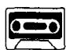
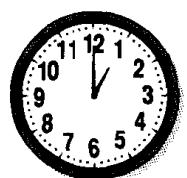
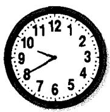

# Lesson 78 When did you ...? 你什么时候……?

Listen to the tape and answer the questions.

听录音并回答问题。

AT:

ON: Sunday Monday Tuesday Wednesday Thursday Friday Saturday

IN: January February March April May June July August September October November December

IN: 1988 1989 1990 1991 1992 1993 1994 1995 1996 1997

ON: July 1st Aug. 2nd Sept. 3rd 4th Oct. 5th Nov. 6th Dec.

## Written exercises 书面练习

A Complete these sentences.

把下列句子改写成过去时。

## Example :

She goes to town every day. She went to town yesterday.

1 She buys a new car every year. She \_\_\_\_ a new car last year.

2 She airs the room every day. She \_\_\_\_ it this morning.

3 He often loses his pen. He \_\_\_\_ his pen this morning.

4 She always listens to the news. She \_\_\_\_ to the news yesterday.

5 She empties this basket every day. She \_\_\_\_ it yesterday.

B Answer these questions.

模仿例句回答以下问题，注意时间状语的变化。

Examples:

It's eight o'clock. When did you see him?

(half an hour ago)

I saw him at half past seven.

It's Friday. When did she go to London?

(the day before yesterday)

She went to London on Wednesday.

It's June. When did Mr Jones buy that car?

(last month)

He bought that car in May.

1 It's 1997. When did you paint this room? (last year)

2 It's 5th January. When did she meet him? (two months ago)

3 It's a quarter past eleven. When did they arrive? (half an hour ago)

4 It's Sunday. When did he lose his pen? (yesterday)
