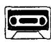
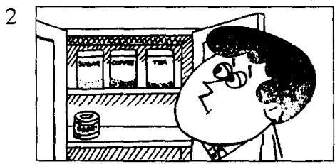
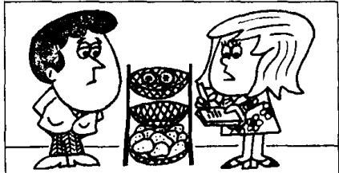
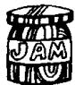

## Lesson 79 Carol's shopping list 卡罗尔的购物单

Listen to the tape then answer this question. What is Carol not going to buy? 听录音，然后回答问题。卡罗尔不准备买什么？

TOM: What are you doing, Carol?
CAROL: I'm making a shopping list, Tom.

TOM: What do we need?
CAROL: We need a lot of things this week.

CAROL: I must go to the grocer's. We haven't got much tea or coffee, and we haven't got any sugar or jam.

TOM: What about vegetables?
CAROL: I must go to the greengrocer's.
We haven't got many tomatoes,
but we've got a lot of potatoes.

CAROL: I must go to the butcher's, too. We need some meat. We haven't got any meat at all.

TOM: Have we got any beer and wine?
CAROL: No, we haven't.
And I'm not going to get any!

TOM: I hope that you've got some money.  
CAROL: I haven't got much.  
TOM: Well, I haven't got much either!

## New words and expressions 生词和短语

shopping /'ʃɒpɪŋ/ n. 购物

hope /həʊp/ v. 希望

list /list/ n. 单子 thing /θɪŋ/ n. 事情

vegetable /'vedʒtəbəl/ n. 蔬菜 money /'mʌni/ n. 钱

need /niːd/ v. 需要

## Notes on the text 课文注释

1 make a shopping list, 写一张采购物品的单子。

2 a lot of 当 “许多” 讲，既可用在可数名词前，又能用在不可数名词前，一般用于肯定句。

3 We haven't got any meat at all. 我们一点肉也没有了。

at all 这个词组用在否定句中，表示“丝毫”、“一点”、“根本”的意思，有强调作用。

have got 与 have （“有”）同义。

4 many 和 much 均可译成 “许多”，但用法不同：many 主要用于疑问句和否定句中，放在可数名词之前。如 many tomatoes; much 用于疑问句和否定句中，放在不可数名词之前，如 much tea, much money。

## 参考译文

汤姆：卡罗尔，你在干什么？

卡罗尔：我在写购物单，汤姆。

汤姆：我们都需要什么？

卡罗尔：这星期我们需要很多东西。

卡罗尔：我得去一下食品店。我们的茶叶和咖啡不多了，糖和果酱也没有了。

汤姆：蔬菜呢？

卡罗尔：我还得到蔬菜水果店去一下。我们的番茄不多了，但土豆还有不少。

卡罗尔：我还要到肉店去一下。我们需要些肉。我们一点肉也没有了。

汤姆：我们还有啤酒和葡萄酒吗？

卡罗尔：没有了。不过，我不打算去买！

汤姆：我希望你还有钱。

卡罗尔：我的钱不多了。

汤姆：唉，我也不多了！

  
120
