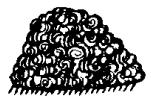
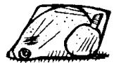
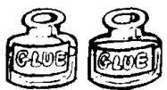

# Lesson 80 I must go to the ... 我必须去

Listen to the tape and answer the questions.

听录音并回答问题。

## GROCER'S to get some GROCERIES:

  
cheese  
121

  
eggs  
122

  
butter

123

  
honey  
124

  
jam  
125

  
biscuits

226

pears

  
227

  
oranges  
228

  
bananas  
229

  
beans  
230

  
peas  
231

  
cabbages

332

  
lamb

  
333

  
beef  
334

  
steak  
335

  
mince  
336

  
chicken

## NEWSAGENT'S to get some STATIONERY:

437

glue

  
438

  
envelopes

439

  
writing paper

440

  
441  
newspapers

  
magazines

543

bread

  
544

  
cakes

545

  
aspirins  
546

  
medicine

## New words and expressions 生词和短语

groceries /'grəʊsərɪz/ n. 食品杂货

newsagent /'nju:z,eɪdʒənt/ n. 报刊零售人

fruit /fruːt/ n. 水果

chemist /'kemist/ n. 药剂师，化学家

stationery /'steɪʃənəri/ n. 文具

## Written exercises 书面练习

A Rewrite these sentences.
模仿例句改写以下句子。

## Examples :

I don't have any eggs. I haven't got many eggs.

He doesn't have any coffee. He hasn't got much coffee.

I don't have any butter.

2 You don't have any envelopes.

3 We don't have any milk.

4 She doesn't have any biscuits.

5 They don't have any stationery.

B Make two statements for each question, as in the examples.
模仿例句用两种方式回答以下每个问题。

## Examples :

Have you got any cheese?

(grocer's)

I need a lot of cheese. I haven't got much.

I must go to the grocer's to get some cheese.

Has he got any envelopes?

(newsagent's)

He needs a lot of envelopes. He hasn't got many.

He must go to the newsagent's to get some envelopes.

1 Have they got any bread?

(baker's)

2 Has she got any eggs?

(grocer's)

3 Have they got any magazines?

(newsagent's)

4 Have you got any beef?

(butcher's)

5 Has she got any butter?

(grocer's)

6 Have they got any bananas?

(greengrocer's)

7 Has he got any medicine?

(chemist's)
