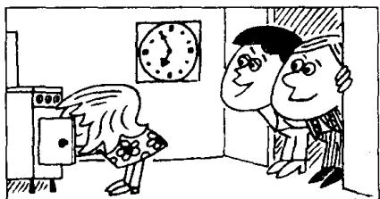
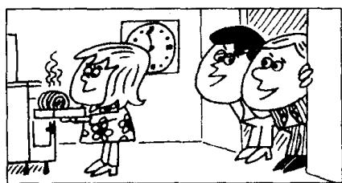

## Lesson 81 Roast beef and potatoes 烤牛肉和土豆

Listen to the tape then answer this question. Why is Carol disappointed? 听录音，然后回答问题。为什么卡罗尔感到失望？

SAM: Hi, Carol! Where's Tom?

CAROL: He's upstairs.  
He's having a bath.

CAROL: Tom!  
TOM: Yes?  
CAROL: Sam's here.  
TOM: I'm nearly ready.

TOM : Hello, Sam.
Have a cigarette.
SAM : No, thanks, Tom.
TOM : Have a glass of whisky then.
SAM : OK. Thanks.

TOM : Is dinner ready, Carol?

CAROL: It's nearly ready. We can have dinner at seven o'clock.

TOM : Sam and I had lunch together today.
We went to a restaurant.

CAROL: What did you have?

TOM : We had roast
beef and potatoes.

CAROL : Oh!

TOM: What's the matter, Carol?

CAROL: Well, you're going to have roast beef and potatoes again tonight!

## New words and expressions 生词和短语

bath /baːθ/ n. 洗澡

dinner /'dɪnə/ n. 正餐，晚餐

nearly /'niəli/ adv. 几乎，将近

restaurant /'restərɒnt/ n. 饭馆，餐馆

ready /'redi/ adj. 准备好的，完好的

roast /rəʊst/ adj. 烤的

## Notes on the text 课文注释

1 在第 13 课中我们见到了这样的句子: Come upstairs ..., 其中的 upstairs 表示动作的方向。本课中的 He's upstairs. 则表示他的方位，其中的 upstairs 可译为 “在楼上”。

2 He's having a bath. 他正在洗澡。在本课中，动词 have 后面接名词或名词短语，有“进行”“从事”的意思，如 have a bath, have a cigarette, have a glass of whisky, have dinner, have lunch 等。

## 参考译文

萨姆：你好，卡罗尔！汤姆在哪儿？

卡罗尔：他在楼上。他正在洗澡。

卡罗尔：汤姆！

汤姆：什么事？

卡罗尔：萨姆来了。

汤姆：我马上就好。

汤姆：你好、萨姆。请抽烟。

萨姆：不，谢谢，汤姆。

汤姆：那么，来杯威士忌吧。

萨姆：好的，谢谢。

汤姆：卡罗尔，饭好了吗？

卡罗尔：马上就好。7点钟我们可以吃饭。

汤姆：我和萨姆今天一起吃的午饭。我们去了一家饭店。

卡罗尔：你们吃什么？

汤姆：我们吃的是烤牛肉和土豆。

卡罗尔：噢！

汤姆：怎么了，卡罗尔？

卡罗尔：唉，今晚你们又要吃烤牛肉和土豆了！
