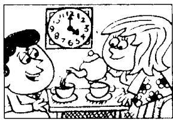
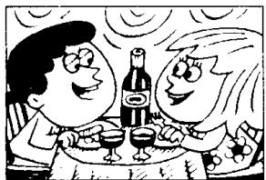
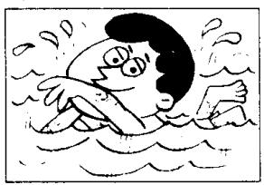
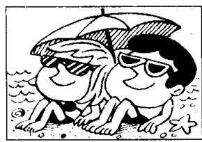

# Lesson 82 I had... 我吃（喝、从事）了……

Listen to the tape and answer the questions.

听录音并回答问题。

760

  
breakfast  
870

  
lunch  
980

  
tea  
1,010

  
dinner  
1,020  
a meal

  
1,030

  
a swim  
1,040

  
a bath  
1,050

  
a haircut  
1,060  
a lesson

  
1,070  
a party

  
1,080

  
a holiday  
1,090

  
a good time

## New words and expressions 生词和短语

breakfast /'brekfəst/ n. 早饭 party /'pɑːti/ n. 聚会 haircut /'heəkʌt/ n. 理发 holiday /'hɒlɪdi/ n. 假日

## Written exercises 书面练习

A Rewrite these sentences using drank, enjoyed yourself, are eating, went for, ate or take.
模仿例句完成以下句子，选用 drank, enjoyed yourself, are eating, went for, ate 或 take。

Example:

I had a cup of coffee. I drank a cup of coffee.

1 They had a meal at a restaurant. They \_\_\_\_ a meal at a restaurant.

2 We had a holiday last month. We \_\_\_\_ a holiday last month.

3 Have a biscuit. \_\_\_\_ a biscuit.

4 You had a good time. You \_\_\_\_.

5 They are having their lunch. They \_\_\_\_ their lunch.

6 I had a glass of milk. I \_\_\_\_ a glass of milk.

B Answer these questions using going to have, having, must have or had.
模仿例句回答以下问题，选用恰当的动词和动词时态。

## Example:

What is he going to do? (a glass of whisky)

He's going to have a glass of whisky.

1 What are they going to do? (breakfast)

2 What are they doing? . (lunch)

3 What must he do? (tea)

4 What did they do? (dinner)

5 What must they do? (a meal)

6 What is he going to do? (a swim)

7 What is he doing? (a bath)

8 What did he do? (a haircut)

9 What are they doing? (a lesson)

10 What did they do? (a party)

11 What must they do? (a holiday)

12 What are they going to do? (a good time)
