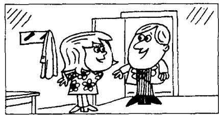
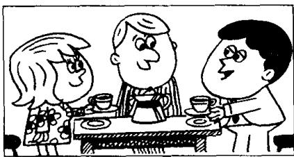
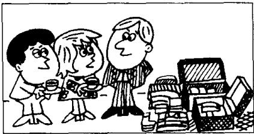

## Lesson 83 'Going on holiday 度假

Listen to the tape then answer this question. Where did Sam go for his holiday this year?

听录音，然后回答问题。今年萨姆去了什么地方度假？

CAROL : Hello, Sam.
Come in.

TOM: Hi, Sam.  
We're having lunch.  
Do you want to have lunch with us?

SAM: No, thank you, Tom.  
I've already had lunch.  
I had lunch at half past twelve.

CAROL : Have a cup of coffee then.

SAM: I've just had a cup, thank you. I had one after my lunch.

TOM: Let's go into the living room, Carol. We can have our coffee there.

CAROL : Excuse the mess, Sam.
This room's very untidy.
We're packing our suitcases.
We're going to leave tomorrow.
Tom and I are going to have a holiday.

SAM: Aren't you lucky!

TOM: When are you going to have a holiday, Sam?

SAM: I don't know.  
I've already had my holiday this year.

CAROL: Where did you go?

SAM: I stayed at home!

## New words and expressions 生词和短语

mess /mes/ n. 杂乱，凌乱

leave /liːv/ (left /left/, left) v. 离开

pack /pæk/ v. 包装，打包，装箱

already /ɔːl'redi/ adv. 已经

suitcase /'su:tkeɪs/ n. 手提箱

## Notes on the text 课文注释

在英语中，现在完成时主要用于以下两种情况：(1) 表示在过去不确定的时间里发生的并与现在有着某种联系的动作；(2) 表示开始于过去并持续到现在的动作。本课中萨姆的 3 句话属于第一种情况，正是因为他吃了饭、喝过了咖啡、也休过假，因此他谢绝了汤姆的邀请，并表示今年已无可能再次休假。现在完成时是由 have 的现在式加上过去分词组成。规则动词的过去分词与过去式相同，而不规则动词的过去分词则无统一的规律可言。从本课起不规则动词还将列出过去分词的拼写和读音。

2 I've already had lunch. 注意 already 的语序。在一般情况下，它跟在助动词后面。

3 Excuse the mess. 意思是：“乱七八糟，请原谅。”

4 have a holiday, 度假。

have 在不同词组中，意思不同。如：have lunch, 吃午饭；have a cup of coffee, 喝杯咖啡。

5 stay at home, 呆在家里，注意名词 home 之前不加任何冠词。在诸如 go home, arrive home 的短语中，home 是副词。

## 参考译文

卡罗尔：你好，萨姆。进来吧。

汤姆：你好，萨姆。我们正在吃午饭，你跟我们一起吃午饭好吗？

萨姆：不，汤姆，谢谢。我已经吃过饭了。我在12点半吃的。

卡罗尔：那么喝杯咖啡吧。

萨姆：我刚喝了一杯，谢谢。我是在饭后喝的。

汤姆：我们到客厅里去吧，卡罗尔。我们可以在那里喝咖啡。

卡罗尔：屋子很乱，请原谅，萨姆。房间里乱七八糟。我们正在收拾手提箱。明天我们就要走了。我和汤姆准备去度假。

萨姆：你们真幸运！

汤姆：萨姆，你准备什么时候去度假？

萨姆：我不知道。今年我已度过假了。

卡罗尔：你去哪儿了？

萨姆：我呆在家里了！
