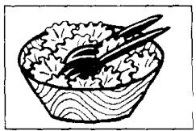
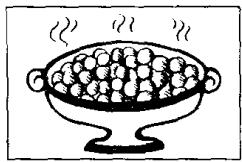
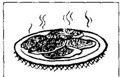
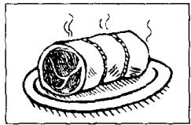
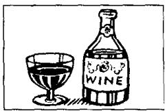

# Lesson 84 Have you had ...? 你已经……了吗？

Listen to the tape and answer the questions.
听录音并回答问题。

1,000

  
fruit  
2,000

  
bananas  
3,000

  
oranges  
4,000

  
peaches  
5,000

  
apples  
6,000

  
7,000  
vegetables

  
lettuce  
8,000

  
cabbage  
9,000

  
peas  
10,000

  
beans  
11,000  
meat

  
12,000

  
beef  
13,000

  
lamb  
14,000

  
steak  
15,000

  
chicken  
16,000  
milk

  
17.000  
tea

  
18,000

  
coffee  
19,000

  
wine  
20,000

  
beer

## Written exercises 书面练习

A Write responses using some or one.

模仿例句写出对应的回答，选用 some 或 one。

## Examples:

' Have some coffee. I've already had some.
Have a banana. I've already had one.

1 Have some beer.  
2 Have an apple.  
3 Have a peach.  
4 Have some milk.  
5 Have a glass of water.  
6 Have a biscuit.  
7 Have some cheese.

## B Answer these questions.

模仿例句回答以下问题。

## Example:

Have you had any vegetables or fruit? (I)

I haven't had any vegetables.

I've just had some fruit.

1 Has he had any beans or peas? (He)

2 Have they had any tea or coffee? (They)

3 Have you had any apples or peaches? (I)

4 Have you had any cabbage or lettuce? (I)

5 Has she had any beer or wine? (She)

6 Has he had any lamb or beef? (He)

7 Have they had any tea or milk? (They)

8 Has she had any meat or vegetables? (She)

9 Have you had any chicken or steak? (I)

10 Have they had any bananas or oranges? (They)
