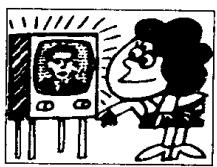
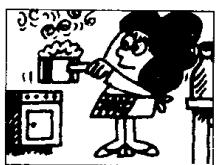
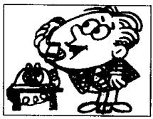
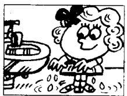
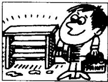
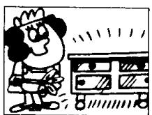

## Lesson 86 What have you done? 你已经做了什么？

Listen to the tape and answer the questions.
听录音并回答问题。

1st

  
aired  
2nd

  
cleaned  
3rd

  
opened  
4th

  
sharpened  
5th

  
turned on  
6th

  
listened to  
7th

  
boiled  
8th

  
answered  
9th

  
emptied  
10th  
asked

  
11th

  
typed  
12th

  
washed  
13th

  
walked  
14th  
painted

  
15th

  
dusted

## Written exercises 书面练习

A Look at these two sentences.

注意以下两个例句。

She has already aired the room.

She aired it this morning.

In which of these sentences can we put has?

在下面的句子中有一般过去时和现在完成时两种不同的时态。选出现在完成时的句子，并填上 has 。

1 She \_\_\_\_ just boiled an egg.

2 She \_\_\_\_ boiled it a minute ago.

3 She \_\_\_\_ never been to China, but he was there in 1992.

4 He \_\_\_\_ already painted that bookcase.

5 He \_\_\_\_ painted it a week ago.

6 She \_\_\_\_ emptied the basket this morning.

7 He \_\_\_\_ just dusted the cupboard.

B Rewrite these sentences.

模仿例句改写以下祈使句。

Example:

Air the room! (this morning)

I've already aired the room.

I aired the room this morning.

1 Clean your shoes! (last night)

2 Open the window! (an hour ago)

3 Sharpen your pencil! (a minute ago)

4. Turn on the television! (ten minutes ago)

5 Boil the milk! (yesterday morning)

6 Empty the basket! (yesterday)

7 Ask a question! (two minutes ago)

8 Type that letter! (this morning)

9 Wash your hands! (five minutes ago)

10 Walk across the park! (an hour ago)

11 Paint that bookcase! (a year ago)

12 Dust the cupboard! (this afternoon)
