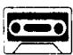

## Lesson 87 A car crash 车祸

Listen to the tape then answer this question.

Can the mechanics repair Mr. Wood's car?

听录音，然后回答问题。修理工能否修复伍德先生的汽车？

MR. WOOD: Is my car ready yet?

ATTENDANT: I don't know, sir. What's the number of your car?

MR. WOOD: It's LFZ 312 G.

ATTENDANT : When did you bring it to us?

MR. WOOD : I brought it here three days ago.

ATTENDANT : Ah yes, I remember now.

MR. WOOD : Have your mechanics finished yet?

ATTENDANT: No, they're still working on it. Let's go into the garage and have a look at it.

ATTENDANT: Isn't that your car?

MR. WOOD : Well, it was my car.

ATTENDANT: Didn't you have a crash?

MR. WOOD : That's right.
I drove it into a lamp-post.
Can your mechanics repair it?

ATTENDANT: Well,
they're trying to repair it, sir.
But to tell you the truth,
you need a new car!

## New words and expressions 生词和短语

attendant /ə'tendənt/ n. 接待员

lamp-post /'læmp-pəʊst/ 灯杆

bring /brɪŋ/ (brought /brɔːt/, brought) v. 带来，送来 repair /rɪˈpeə/ v. 修理

garage /'gærdʒ/ n. 车库，汽车修理厂

try /traɪ/ v. 努力，设法

crash /kræʃ/ n. 碰撞

## Notes on the text 课文注释

1 在英文中可以用一般疑问句的否定形式来表示期待、请求或希望得到肯定的答复，如课文中的 Isn't that your car? 和 Didn't you have a crash?

2 Well, it was my car.

well 是感叹词。在这里表示“哎”。was 用斜体，表示“过去是，现在不是了”。was 要重读。

3 drive into 是 “撞倒……” 的意思。

4 they're trying to repair it. 他们正在设法修理。try 后面常接 to+ 动词不定式。

## 参考译文

伍德先生：我的汽车修好了吗？

服务员：我不知道，先生。您的汽车牌号是多少？

伍德先生：是LFZ312G。

服务员：您什么时候送来的？

伍德先生：3 天前。

服务员：啊，是的，我现在记起来了。

伍德先生：你们的机械师修好了吗？

服务员：没有，他们还在修呢。我们到车库去看一下吧。

服务员：这难道不是您的车吗？

伍德先生：唔，这曾是我的车。

服务员：难道您没有出车祸吗？

伍德先生：是啊。我把汽车撞在电线杆上了。你们的机械师能修好吗？

服务员：啊，他们正设法修呢，先生。不过说实在的，您需要一辆新车了！
