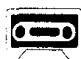

## Lesson 88 Have you . . . yet? 你已经……了吗？

Listen to the tape and answer the questions.

听录音并回答问题。

]  
  
Have you met Mrs. Jones yet? Yes, I have. When did you meet her? I met her two weeks ago.

2  
  
Has the boss left yet?
Yes, he has.
When did he leave?
He left ten minutes ago.

3  
  
4  
Have you had breakfast yet?

  
Has she found her pen yet?
Yes, she has.
When did she find it?
She found it an hour ago.

Yes, we have.  
When did you have it?  
We had it at half past seven.

Study these verbs.

记住以下不规则动词的过去式和过去分词。

<table><tr><td>buy</td><td>bought</td><td>bought</td><td>lose</td><td>lost</td><td>lost</td></tr><tr><td>find</td><td>found</td><td>found</td><td>make</td><td>made</td><td>made</td></tr><tr><td>get</td><td>got</td><td>got</td><td>meet</td><td>met</td><td>met</td></tr><tr><td>have</td><td>had</td><td>had</td><td>send</td><td>sent</td><td>sent</td></tr><tr><td>hear</td><td>heard</td><td>heard</td><td>sweep</td><td>swept</td><td>swept</td></tr><tr><td>leave</td><td>left</td><td>left</td><td>tell</td><td>told</td><td>told</td></tr></table>

## Written exercises 书面练习

A Write questions and answers.

模仿例句就以下句子提问，并作出否定的回答。

Example:

He bought a house last year.

QUESTION: Did he buy a house last year?

NEGATIVE: He didn't buy a house last year.

1 He found his pen a minute ago.

2 He got a new television last week.

3 We heard the news on the radio.

4 They left this morning.

5 He lost his umbrella yesterday.

6 I swept the floor this morning.

B Write questions and answers.
模仿例句提问并回答。

## Example:

they/buy a new house/two weeks ago

Have they bought a new house yet?

Yes, they have already bought a new house.

When did they buy a new house?

They bought a new house two weeks ago.

1 he/meet Mrs. Jones/two weeks ago

2 the boss/leave/ten minutes ago

3 he/have breakfast/at half past seven

4 she/find her pen/an hour ago

5 he/get a television/two weeks ago

6 she/hear the news/yesterday

7 she/make the bed/this morning

8 he/send the letter/the day before yesterday

9 she/sweep the floor/yesterday morning

10 she/tell him the truth/last night
