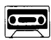
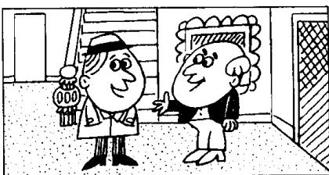

## Lesson 89 For sale 待售

Listen to the tape then answer this question. Why couldn't Nigel decide? 听录音，然后回答问题。为什么奈杰尔作不了决定？

NIGEL : Good afternoon.
I believe that
this house is for sale.

IAN : That's right.

NIGEL : May I have a look at it, please?

IAN : Yes, of course.
Come in.

NIGEL: How long have you lived here?

IAN: I've lived here for twenty years.

NIGEL: Twenty years!
That's a long time.

IAN: Yes, I've been here since 1976.

NIGEL : Then why do you want to sell it?

IAN : Because I've just retired.  
I want to buy  
a small house in the country.

NIGEL : How much does this house cost?

IAN: £68,500.

NIGEL: That's a lot of money!

IAN: It's worth every penny of it.

NIGEL: Well, I like the house,
but I can't decide yet.
My wife must see it first.

IAN : Women always have the last word.

## New words and expressions 生词和短语

believe /bɪˈliːv/ v. 相信，认为

because /bɪˈkɒz/ conj. 因为

may /meɪ/ modal verb (用于请求许可) 可以

retire /rɪˈtaɪə/ v. 退休

how long 多长

cost /kɒst/ (cost, cost) v. 花费

since /sɪns/ prep. 自从

pound /paʊnd/ n. 英镑 (£)

why /waɪ/ adv. 为什么

worth /wɜːθ/ prep. 值……钱

sell /sel/ (sold /səʊld/, sold) v. 卖，出售

penny /'peni/ n. 便士

## Notes on the text 课文注释

1 for sale, 供出售，待售。

2 May I ...? 是一种比较正式的表示请求的句型。其中的 may 有 “请求允许” 的意思。

3 It's worth every penny of it.

有强调的意思，后面的一个it是指刚才提到的那笔钱。全句的意思是：“你支付出的每一个便士都是划算的”，可以译成：“它确实值这么多钱。”

4 I can't decide yet. 我还不能决定。句中的 yet 常用在否定句中，表示“迄今仍未”的意思。

5 My wife must see it first. 我的妻子必须先来看一看。其中的 must 当 “必须” 讲。

6 have the last word, 最后拍板。

## 参考译文

奈杰尔：下午好。我想这房子是要出售的吧！

伊恩：是的。

奈杰尔：我可以看一看吗？

伊恩：可以，当然可以。请进。

奈杰尔：您在这里住了多长时间？

伊恩：我在这里已经住了20年了。

奈杰尔：20年！这个时间可不短。

伊恩：是啊，从1976年起我就住在这里。

奈杰尔：那么，您为什么要卖掉它呢？

伊恩：因为我刚退休。我想在乡下买幢小房子。

奈杰尔：这座房子卖多少钱？

伊恩：68,500英镑。

奈杰尔：那可真是一大笔钱呢！

伊恩：它确确实实值这么多钱。

奈杰尔：啊，我喜欢这房子，但我还不能决定。我妻子必须先来看一看。

伊恩：女人总是最后说了算的。
