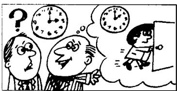

## Lesson 90 Have you . . . yet? 你已经……了吗？

Listen to the tape and answer the questions.

听录音并回答问题。

}  
  
Have you read this book yet? Yes, I have. When did you read it? I read it last year.

2  
  
Have you done your homework yet?
Yes, I have.
When did you do it?
I did it half an hour ago.

3  

4  

Has he gone yet?
Yes, he has.
When did he go?
He went an hour ago.

Has she spoken to him yet?
Yes, she has.
When did she speak to him?
She spoke to him yesterday.

Study these verbs.

记住以下不规则动词的过去式和过去分词。

<table><tr><td>cut</td><td>cut</td><td>cut</td><td>do</td><td>did</td><td>done</td><td>eat</td><td>ate</td><td>eaten</td></tr><tr><td>put</td><td>put</td><td>put</td><td>come</td><td>came</td><td>come</td><td>go</td><td>went</td><td>gone</td></tr><tr><td>read</td><td>read</td><td>read</td><td>give</td><td>gave</td><td>given</td><td>rise</td><td>rose</td><td>risen</td></tr><tr><td>set</td><td>set</td><td>set</td><td>swim</td><td>swam</td><td>swum</td><td>see</td><td>saw</td><td>seen</td></tr><tr><td>shut</td><td>shut</td><td>shut</td><td>take</td><td>took</td><td>taken</td><td>speak</td><td>spoke</td><td>spoken</td></tr></table>

## Written exercises 书面练习

A Write questions and answers.

模仿例句就以下句子提问，并作出否定的回答。

## Example:

He read this book last week.

QUESTION: Did he read this book last week?

NEGATIVE: He didn't read this book last week.

1 The sun set at twenty past seven.

2 He ate his lunch at one o'clock.

3 They did their homework last night.

4 He came by car this morning.

5 The sun rose at half past five.

6 We swam across the river yesterday.

B Answer these questions.
模仿例句回答以下问题。

## Examples:

Did you read this book last week?

Yes, I read this book last week.

What about Penny?

She hasn't read this book yet.

1 Did you do your homework last night?
What about Tom?

3 Did you speak to him yesterday?
What about Susan?

4 Did George swim across the river an hour ago?
What about Sam?

5 Did you see that film yesterday?
What about Sam and Penny?

6 Did Tim take off his shoes a minute ago?
What about Frank?
