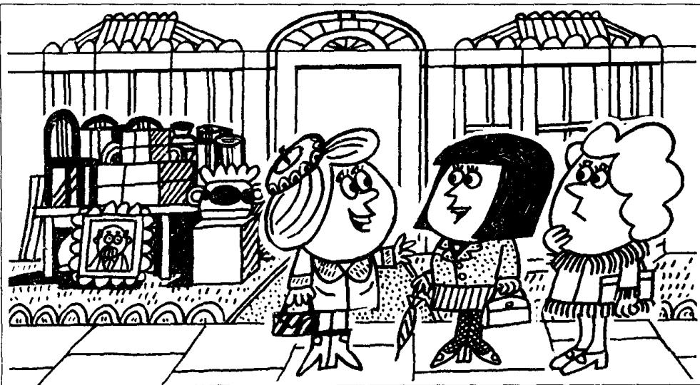

## Lesson 91 Poor Ian! 可怜的伊恩!

Listen to the tape then answer this question. Who wanted to sell the house? 听录音，然后回答问题。谁想卖房？

CATHERINE: Has Ian sold his house yet?

JENNY : Yes, he has.
He sold it last week.

CATHERINE : Has:he moved to his new house yet?

JENNY : No, not yet.
He's still here.
He's going to move tomorrow.

CATHERINE: When? Tomorrow morning?

JENNY : No. Tomorrow afternoon.
I'll miss him.
He has always been a good neighbour.

LINDA : He's a very nice person. We'll all miss him.

CATHERINE: When will the new people move into this house?

JENNY : I think that they'll move in the day after tomorrow.

LINDA: Will you see Ian today, Jenny?

JENNY: Yes, I will.

LINDA : Please give him my regards.

CATHERINE: Poor Ian!
He didn't want to leave this house.

JENNY: No, he didn't want to leave, but his wife did!

## New words and expressions 生词和短语

still /stɪl/ adv. 还，仍旧

person /'pɜːsən/ n. 人

move /muːv/ v. 搬家

people /'piːpəl/ n. 人们

miss /mɪs/ v. 想念，思念

poor /pʊə/ adj. 可怜的

neighbour /'neɪbə/ n. 邻居

## Notes on the text 课文注释

1 No. not yet. 不，还没有。

这是简略回答，完整的回答是 He hasn't moved to his new house yet.

2 He's a very nice person. 他是一个非常好的人。person 是指人。当需要表示复数形式时，往往用 people 这个词。如后面的一句话 When will the new people move into this house?

3 Please give him my regards. 请代我问候他。

4 No. he didn't want to leave ... 是对上一句话的证实。由于上一句话中用了否定形式，因此，在证实时句中的动词不可模仿前一句话的形式，而要根据事实来决定。但在译成汉语时，No 就要译成肯定的意思，如：“是的，他不想离开。”

## 参考译文

凯瑟琳：伊恩已把他的房子卖掉了吗？

詹尼：是的，卖掉了。他上星期卖掉的。

凯瑟琳：他已经迁进新居了吗？

詹尼：不，还没有。他仍在这里。他打算明天搬家。

凯瑟琳：什么时候？明天上午吗？

詹尼：不，明天下午。我会想念他的。他一直是个好邻居。

琳达：他是个非常好的人，我们大家都会想念他的。

凯瑟琳：新住户什么时候搬进这所房子？

詹尼：我想他们将在后天搬进来吧。

琳达：詹尼．您今天会见到伊恩吗？

詹 尼 ： 是的 ， 我会见到他 。

琳达：请代我问候他。

凯瑟琳：可怜的伊恩！他本不想离开这幢房子。

詹尼：是啊，他是不想离开，可是他妻子要离开。
