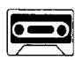
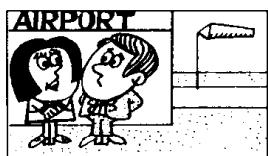
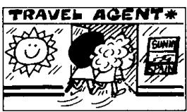
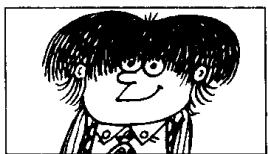
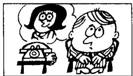
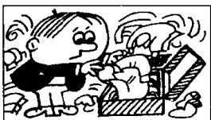

## Lesson 92 When will ...? 什么时候要

Listen to the tape and answer the questions.

听录音并回答问题。

TODAY

TOMORROW

THE DAY AFTER TOMORROW

this morning

tomorrow morning

the day after tomorrow

in the morning

this afternoon

tomorrow afternoon

the day after tomorrow

in the afternoon

this evening

tomorrow evening

the day after tomorrow

in the evening

tonight

tomorrow night

the night after next

1st

  
rain  
2nd

  
snow  
3rd

  
leave  
4th

  
get up  
5th  
arrive

  
6th

  
finish work  
7th

  
have a holiday  
8th

  
drive home

9th

  
have a haircut  
10th

  
telephone me  
11th

  
have a shave  
12th

  
pack his bags  
13th

  
sweep the floor  
14th

  
paint this room  
15th

  
repair my car  
16th

  
make an  
appointment

## Written exercises 书面练习

A Rewrite these sentences.
模仿例句改写以下句子。

Example:

It will rain tomorrow.

It'll rain tomorrow.

1 He will arrive tomorrow morning.

2 She will come this evening.

3 It will snow tonight.

4 He will not believe me.

B Rewrite these sentences.
模仿例句确认以下的每一句话。

## Example:

It rained yesterday.

Yes, and it will rain tomorrow, too.

1 It snowed yesterday.

2 He got up late yesterday.

3 He arrived late yesterday.

4 He finished work late yesterday.

5 She drove to London yesterday.

6 She telephoned him yesterday.

7 He had a shave yesterday.

8 She swept the floor yesterday.
