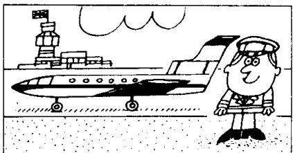
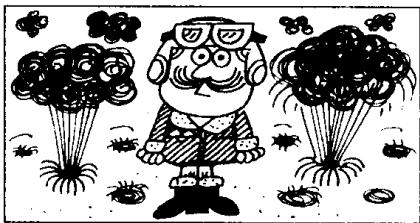
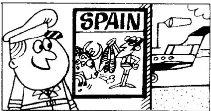
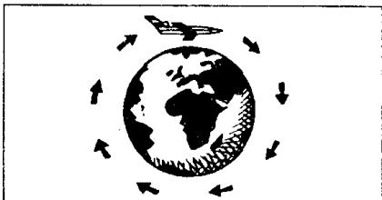

## Lesson 93 Our new neighbour 我们的新邻居

Listen to the tape then answer this question. Why is Nigel a lucky man? 听录音，然后回答问题。为什么说奈杰尔很幸运？

Nigel is our new next-door neighbour. He's a pilot.

He was in the R.A.F.

He will fly to New York next month.

The month after next he'll fly to Tokyo.

At the moment, he's in Madrid. He flew to Spain a week ago.

He'll return to London the week after next.

He's only forty-one years old, and he has already been to nearly every country in the world.

Nigel is a very lucky man. But his wife isn't very lucky. She usually stays at home!

## New words and expressions 生词和短语

pilot /'paɪlət n. 飞行员

Tokyo /'təʊkɪəʊ/ n. 东京

return /rɪˈtɜːn/ v. 返回

Madrid /mə'drɪd/ n. 马德里

New York /'njuː-'jɔ:k/ n. 纽约

fly /flaɪ/ (flew /fluː/, flown /fləʊn/) v. 飞行

## Notes on the text 课文注释

1 next-door neighbour, 隔壁邻居。next-door 是一个复合词，作定语。

2 the R.A.F. = the Royal Air Force, 英国皇家空军。

3 He is only forty-one years old, and he has ...

本句中的 and 相当于 but（而……），起转折作用。

## 参考译文

奈杰尔是我们新搬来的隔壁邻居。他是个飞行员。

他曾在皇家空军任职。

下个月他将飞往纽约。

再下个月他将飞往东京。

现在他在马德里。他是一星期以前飞到西班牙的。

再下个星期他将返回伦敦。

他只有41岁，但他却去过世界上几乎每一个国家。

奈杰尔是个很幸运的人。但他的妻子运气不很好。她总是呆在家里！
