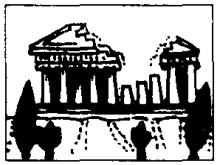
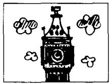
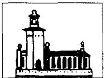
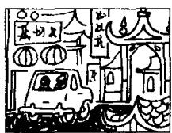

# Lesson 94 When did you/will you go to ...? 你过去／将在什么时候去……？

15  
10  
3  
4  
1  

Listen to the tape and answer the questions.
听录音并回答问题。

last week

last month

this week

next week

this month

last year

this year

next month

the week after next

next year

the month after next

the year after next

Athens

2  
  
Beijing

  
Berlin

  
Bombay

5  
  
Geneva  
London

6  

7  
  
Madrid

8  
  
Moscow

9  
  
New York

  
Paris  
Rome

12

  
Seoul  
Stockholm

13

  
Sydney

  
Tokyo

## New words and expressions 生词和短语

Athens /'æθɪnz/ n. 雅典

Rome /rəʊm/ n. 罗马

Berlin /bɜːˈlɪn/ n. 柏林

Seoul /səʊl/ n. 汉城

Bombay /bɒm'beɪ/ n. 盖头

Stockholm /'stɒkhəʊm/ n. 斯德哥尔摩

Geneva /dʒɪˈniːvə/ n. 甘内瓦

Moscow /'mɒskəʊ/ n. 莫斯科

Sydney /'sɪdni/ n. 悉尼

## Written exercises 书面练习

A Rewrite these sentences using will.
模仿例句改写以下句子，用上 will。

## Example:

He went to Beijing last year.
He will go to Beijing next year.

1 He went to New York last week.

2 She went to Sydney last month.

3 I went to Paris the year before last.

4 We went to Stockholm last year.

5 They went to Geneva the week before last.

## B Answer these questions.

模仿例句回答以下问题。

## Example:

Will you go to Athens next week? (Beijing)

No, I won't go to Athens next week. I'll go to Beijing.

1 Will Helen return to Geneva next year? (Bombay)

2 Will you fly to London tomorrow? (Geneva)

3 Will you and Tom go to Madrid next year? (London)

4 Will Tom arrive from Moscow next month? (Madrid)

5 Will Carol and Helen stay in New York next month? (Moscow)
