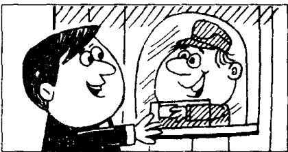
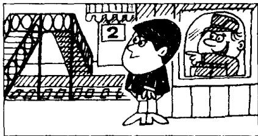
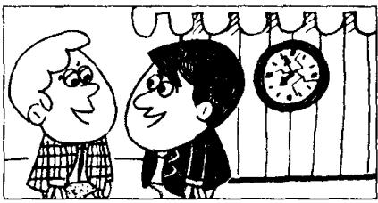
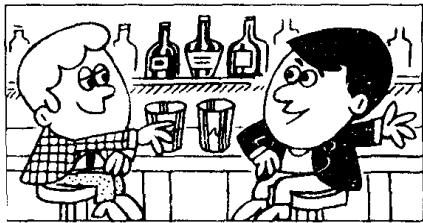
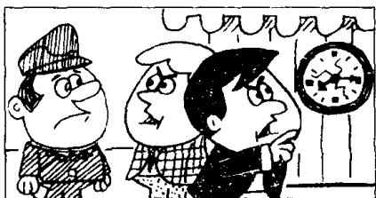

## Lesson 95 Tickets, please. 请把车票拿出来。

Listen to the tape then answer this question.
Why did George and Ken miss the train?
听录音，然后回答问题。为什么乔治和肯误了火车？

GEORGE : Two return tickets to London, please.
What time will the next train leave?
ATTENDANT : At nineteen minutes past eight.

GEORGE : Which platform?
ATTENDANT : Platform Two.
Over the bridge.

KEN : What time will the next train leave?
GEORGE : At eight nineteen.
KEN : We've got plenty of time.

GEORGE : It's only three minutes to eight.
KEN : Let's go and have a drink.
There's a bar
next door to the station.

GEORGE : We had better
go back to the station now, Ken.

PORTER : Tickets, please.
GEORGE : We want to catch
the eight nineteen to London.
PORTER : You’ve just missed it!
GEORGE : What!
It’s only eight fifteen.
PORTER : I’m sorry, sir.
That clock’s ten minutes slow.
GEORGE : When’s the next train?
PORTER : In five hours’ time!

## New words and expressions 生词和短语

return /rɪˈtɜːn/ n. 往返

bar /baː/ n. 酒吧

train /treɪn/ n. 火车

station /'steɪʃən/ n. 车站，火车站

platform /'plætʃɔːm/ n. 站台

plenty /'plenti/ n. 大量

porter /'pɔːtə/ n. 收票员

catch /kætʃ/ (caught /kɔːt/, caught) v. 赶上

miss /mɪs/ v. 错过

## Notes on the text 课文注释

1 return ticket, 往返票。

2 next door to ..., 与……相邻，在……隔壁。

3 had better 相当于情态动词，当“最好”讲，用于指现在和将要做的事情。各种人称后面的形式相同，简写作'd better。后面接动词原形。

\+ catch the eight nineteen to London.

这里的 eight nineteen 是指 8 点 19 分的火车，to London 是表示火车的行车方向。

5 in five hours' time, 5 小时之后。

这里的介词 in 是 “在……之后” 的意思，复数名词 hours 后面用所有格，直接加表示所有格的撇号就可以，不必再加 -s。

## 参考译文

乔治：买两张到伦敦的往返票。下一班火车什么时候开？

服务员：8点19分。

乔治：在哪个站台？

服务员：2号站台。过天桥。

背：下一班火车什么时候开？

乔治：8点19分。

肯：我们的时间还很宽裕。

乔治：现在才7点57分。

肯：让我们去喝点东西吧，车站旁有一个酒吧。

乔治：肯，我们现在最好回到车站去。

收票员：请把车票拿出来。

乔治：我们要乘8点19分的车去伦敦。

收票员：你们刚好错过了那班车。

乔治：什么！现在只有8点15分。

收票员：对不起，先生，那个钟慢了10分钟。

乔治：下一班车是什么时候？

收票员：5个小时以后！
