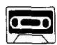
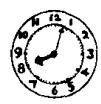
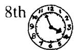
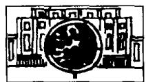
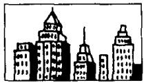

# Lesson 96 What's the exact time? 确切的时间是几点？

Listen to the tape and answer the questions.

听录音并回答问题。

1st

2nd

7th

3rd

9th

4th

5th

6th

12th

a minute/two minutes

an hour/two hours

a day/two days

a week/two weeks

AGO

a month/two months

a year/two years

a minute's/two minutes'

an hour's/two hours'

IN

a day's/two days'

TIME

a week's/two weeks'

a month's/two months'

a year's/two years'

## When did he/will he go to ...? 他曾／将在什么时候去……？

1

  
Athens

2

  
Beijing

3

  
Berlin

4

  
Bombay

5

  
Geneva

6

  
London

7

  
Madrid

8

  
Moscow

9

  
New York

10

  
Paris

11

Rome

  
Seoul

12

  
Stockholm

13

  
Sydney

14

15

  
Tokyo

## Written exercises 书面练习

A Rewrite these sentences using had better.

用 had better 来改写以下句子:

## Example:

We must go back to the station.

We had better go back to the station.

1 I must stay here.

2 We must wait for him.

3 You must call a doctor.

4 They must go home.

5 She must hurry.

6 You must be careful.

## B Answer these questions using 'll.

模仿例句回答以下问题，用上 11。

## Examples:

I went to Beijing a year ago. What about you?

a year's time

I'll go to Beijing in a year's time.

Tom flew to Stockholm two weeks ago. What about Pamela?

two weeks' time

She'll fly to Stockholm in two weeks' time.

Dave and Alan returned to Tokyo two days ago. What about you and Jean?

two days' time

We'll return to Tokyo in two days' time.

1 I went to Sydney a month ago. What about you? a month's time

2 A train left for Geneva an hour ago. What about the next one? an hour's time

3 Carol flew to Beijing two days ago. What about you? two days' time

4 Tom and Mary went to London an hour ago. What about you and Jean? an hour's time
