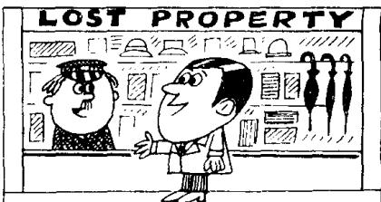
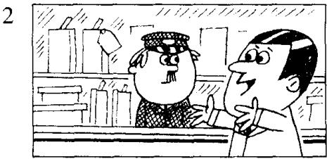
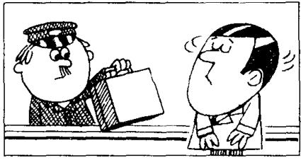
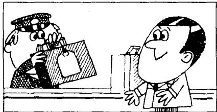
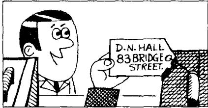
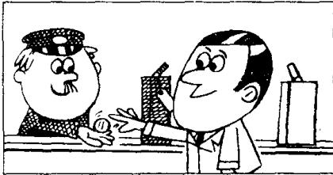
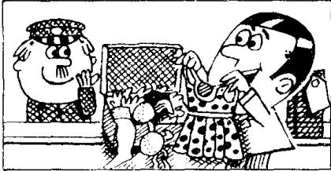

## Lesson 97 A small blue case 一只蓝色的小箱子

Listen to the tape then answer this question. Does Mr. Hall get his case back? 听录音，然后回答问题。霍尔先生有没有要回他的提箱？

MR. HALL: I left a suitcase on the train to London the other day.

ATTENDANT : Can you describe it, sir?

MR. HALL : It's a small blue case and it's got a zip.
There's a label on the handle with my name and address on it.

ATTENDANT: Is this case yours?

MR. HALL: No, that's not mine.

ATTENDANT: What about this one? This one's got a label.

MR. HALL: Let me see it.

ATTENDANT: What's your name and address?

MR. HALL : David Hall,
83, Bridge Street.

ATTENDANT: That's right. D.N.Hall, 83,Bridge Street.

ATTENDANT : Three pounds fifty pence, please.

MR. HALL : Here you are.

ATTENDANT : Thank you.

MR. HALL : Hey!

ATTENDANT: What's the matter?

MR. HALL : This case doesn't belong to me!
You've given me the wrong case!

## New words and expressions 生词和短语

leave /liːv/ (left /left/, left) v. 遗留

handle /'hændl/ n. 提手，把手

describe /dɪˈskraɪb/ v. 描述

address /ə'dres/ n. 地址

zip /zɪp/ n. 拉链

label /'leibəl/ n. 标签

pence /pens/ n. penny 的复数形式

belong /bɪˈlɒŋ/ v. 属于

## Notes on the text 课文注释

I the other day. 几天前。

2 It's got a zip.

句中的 it's = it has. 不是 it is。

3 Is this case yours? 这箱子是您的吗？其中的 yours 是表示所有格的代词，所有格代词不能用于名词之前，在句中一般要重读。

4 83, Bridge Street, 大桥街 83 号。

在英文中书写地址时，要把门牌号放在街名的前面。

5 Hey! 感叹词，用来表示惊讶、疑问或用以引起注意。

## 参考译文

霍尔先生：几天前我把一只手提箱忘在开往伦敦的火车上了。

服务员：先生，您能描述一下它是什么样子的吗？

霍尔先生：是只蓝色的小箱子，上面有拉链。箱把上有一标签，上面写着我的姓名和住址。

服务员：这箱子是您的吗？

霍尔先生：不，那不是我的。

服务员：这只是不是？这只箱子有张标签。

霍尔先生：让我看看。

服务员：您的姓名和住址？

霍尔先生：大卫·霍尔，大桥街83号。

服务员：那就对了。D·N·霍尔，大桥街83号。

服务员：请付3英镑50便上。

霍尔先生：给您。

服务员：谢谢您。

霍尔先生：嗨！

服务员：怎么回事？

霍尔先生：这箱子不是我的！您给错了！
