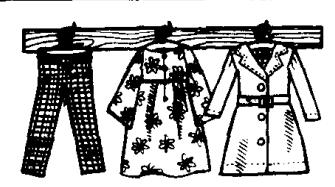
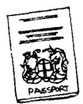
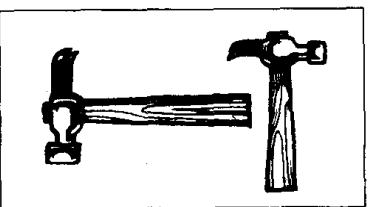

## Lesson 98 Whose is it? 它是谁的？ Whose are they? 它们是谁的？

11  

Listen to the tape and answer the questions.
听录音并回答问题。

Does this belong to me?

Does this belong to you?

Is this mine?

Is this yours?

Does this belong to him?

Is this his?

• Does this belong to her?

Is this hers?

Do these belong to us?

Are these ours?

Do these belong to you?

Are these yours?

Do these belong to them?

Are these theirs?

1  

2  

3  

4  

5  

6  

7  

8  

9  

10  

12  

## Written exercises 书面练习

A Complete these sentences.

模仿例句完成以下句子，选用适当的所有格代词。

Example:

This dress belongs to my sister. It is hers.

1 These things belong to my husband. They \_\_\_\_ \_\_\_\_.

2 This coat belongs to me. It \_\_\_\_.

3 These shoes belong to my wife. They \_\_\_\_.

4 These books belong to my brother and me. They \_\_\_\_ .

5 These pens belong to Tom and Jill. The pens \_\_\_\_.

6 This suitcase belongs to you. It \_\_\_\_.

## B Answer these questions.

模仿例句回答以下问题。

Examples:

Are these your keys?

Yes, they're mine. They belong to me.

Is this John's letter?

Yes, it's his. It belongs to him.

Are these my clothes?

Yes, they're yours. They belong to you.

1 Is this Jane's passport?

2 Are these their tickets?

3 Is this your watch?

4 Are these her flowers?

5 Is this my boat?

6 Is this Jim's phrasebook?

7 Are these hammers Frank's and Gary's?

8 Is this our car?

9) Are these the children's pens?
