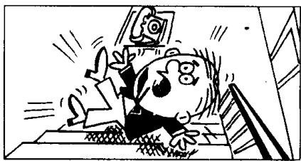
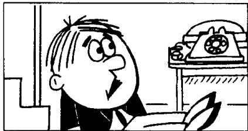
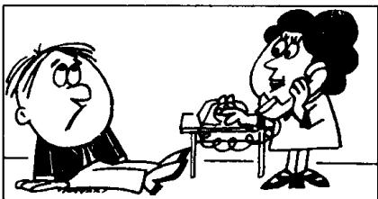

## Lesson 99 Ow! 啊哟!

Listen to the tape then answer this question. Must Andy go to see the doctor? 听录音，然后回答问题。安迪需要去看医生吗？

ANDY : Ow!

LUCY: What's the matter, Andy?
ANDY: I slipped and fell downstairs.

LUCY: Have you hurt yourself?  
ANDY: Yes, I have.  
I think that  
I've hurt my back.

LUCY: Try and stand up.
Can you stand up?
Here.
Let me help you.

ANDY: I'm sorry, Lucy.  
I'm afraid that  
I can't get up.

LUCY: I think that
the doctor had better see you.
I'll phone Dr. Carter.

LUCY: The doctor says that he will come at once. I'm sure that you need an X-ray, Andy.

## New words and expressions 生词和短语

ow /aʊ/ int. 哎哟

stand up /'stænd-'ʌp/ 起立，站起来

slip /slɪp/ v. 滑倒，滑了一脚

help /help/ v. 帮助

fall /fɔːl/ (fell /fel/, fallen /'fɔːlən/) v. 落下，跌倒

at once 立即

downstairs /ˌdaʊnˈsteəz/ adv. 下楼

sure /ʃɔː/ adj. 一定的，确信的

hurt /hɜːt/ (hurt, hurt) v. 伤，伤害，疼痛

X-ray /'eks-rei/ n. X 光透视

back /bæk/ n. 背

## Notes on the text 课文注释

1 fell downstairs, 从楼梯上摔下来。

downstairs 是副词，修饰 fell，作状语。

2 Try and stand up. 试着站起来。在英语中，常用 and 把两个动词连接在一起，如第 13 课的 come upstairs and see it. 这种句子往往用来鼓励某种动作。

3 Here 在这里是感叹词，意思是“来”或“喂”，引起别人注意。

4 Let me help you. 让我来帮你。其中 let 有 “允许” 的意思。注意在 let 后面要加不带 to 的动词不定式。

5 The doctor says that he will come at once.

在英文中如果要把某人所说的话告诉另一个人，要用间接引语。间接引语不用引号，往往在引语前加 that 等引导词。

## 参考译文

安迪：啊哟！

露西：怎么了，安迪？

安迪：我滑了一跤，从楼梯上摔下来了。

露西：你摔伤了没有？

安迪：是啊，摔伤了。我想我把背摔坏了。

露西：试试站起来。你能站起来吗？来，让我帮你。

安迪：对不起，露西，恐怕我站不起来。

露西：我想最好请医生来给你看一下。我去给卡特医生打电话。

露西：医生说他马上就来。安迪，我看你需要做一次 X 光透视。
