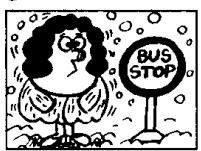
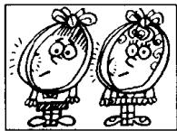
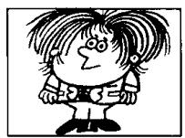
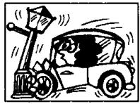

# Lesson 100 He says that . . . She says that . . . They say that . . . 他／她／他们说……

9  
12  
11  

Listen to the tape and answer the questions.
听录音并回答问题。

<table><tr><td rowspan="3"></td><td>says</td><td></td><td>is ...</td></tr><tr><td>thinks</td><td></td><td>feels ...</td></tr><tr><td>believes</td><td></td><td>has (got) ...</td></tr><tr><td rowspan="5">He</td><td>knows</td><td>that he</td><td>needs ...</td></tr><tr><td>understands</td><td></td><td>wants ...</td></tr><tr><td>is afraid</td><td></td><td>can ...</td></tr><tr><td>is sorry</td><td></td><td>must ...</td></tr><tr><td>is sure</td><td></td><td>will ...</td></tr></table>

is/are
feel(s)

  
tired  
thirsty

  
cold

  
ill

has/have
(got)

  
acold

  
a headache

  
an earache

  
a toothache

need(s)
want(s)

a haircut

10  
  
a licence

  
an X-ray

  
some money

can
must
will

14  
  
15  
wait

  
catch

  
repair

16  
  
sell

# New words and expressions 生词和短语

licence /'laɪsəns/ n. 执照

## Written exercises 书面练习

A Rewrite these sentences.

模仿例句把下列句子改写成间接引语。

## Example:

He is drinking his milk. He says that he is drinking his milk.

1 She has found her pen.

2 They must remain here.

3 He remembers you.

4 She doesn't speak English.

5 They're washing the dishes.

## B Answer these questions.

模仿例句用间接引语回答以下问题。

Examples:

What's the matter with him? (feel/tired)

He says that he feels tired.

What do they want? (some/money)

They say that they want some money.

1 What's the matter with him? (feel/ill)

2 What's the matter with her? (have got/a headache)

3 What does he want? (a haircut)

4 What's the matter with them? (are/thirsty)

5 What's the matter with them? (have/a toothache)

6 What does she need? (a licence)

7 What does he want? (an X-ray)

8 What's the matter with her? (is/cold)

9 What's the matter with him? (have got/a cold)

10 What's the matter with him? (have/an earache)
