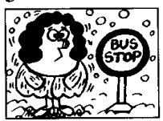
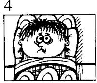
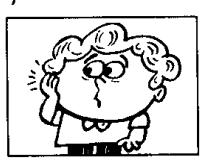
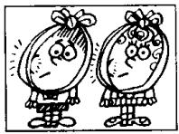
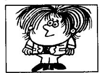

# Lesson 102 He says he . . . She says she . . . They say they . . . 他／她／他们说他／她／他们……

6  
9  
12  
8  

Listen to the tape and answer the questions.

听录音并回答问题。

<table><tr><td rowspan="3"></td><td>says</td><td></td><td>is . . .</td></tr><tr><td>thinks</td><td></td><td>feels . . .</td></tr><tr><td>believes</td><td></td><td>has (got) . . .</td></tr><tr><td rowspan="5">He</td><td>knows</td><td>he</td><td>needs . . .</td></tr><tr><td>hopes</td><td></td><td>wants . . .</td></tr><tr><td>is afraid</td><td></td><td>can . . .</td></tr><tr><td>is sorry</td><td></td><td>must . . .</td></tr><tr><td>is sure</td><td></td><td>will . . .</td></tr></table>

## is/are feel(s)

  
tired  
thirsty

  
cold

  
ill

has/have
(got)

  
acold

  
a headache

  
an earache

  
a toothache

need(s)
want(s)

  
a haircut

10  
  
a licence

  
an X-ray

  
some money

can
must
will

## 13

  
wait  
catch

## 14

  
repair

  
sell

## Written exercises 书面练习

A Rewrite these sentences.

模仿例句把下列句子改写成间接引语。

Example:

He is drinking his milk.
He says he has drunk his milk.

1 She is shutting the door.

2 He is putting on his coat.

3 He is reading this magazine.

4 They are speaking to the boss.

5 The sun is rising.

## B Look at this table.

注意以下表格。

<table><tr><td rowspan="3"></td><td rowspan="3"></td><td>cold</td></tr><tr><td>a bus</td></tr><tr><td>a haircut</td></tr><tr><td rowspan="7">He says he</td><td>has got</td><td>tired</td></tr><tr><td>feels</td><td>a cold</td></tr><tr><td>will sell</td><td>thirsty</td></tr><tr><td>needs</td><td>an X-ray</td></tr><tr><td rowspan="3">must wait for</td><td>an earache</td></tr><tr><td>his house</td></tr><tr><td>ill</td></tr></table>

Now write nine sentences.

利用上表中的短语，模仿例句写出9句话。

## Example:

He says he feels ill.
