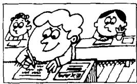
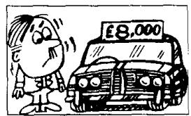
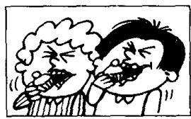
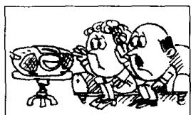
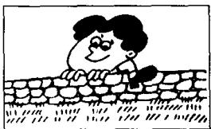
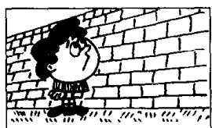
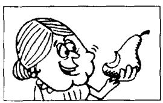
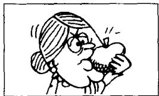
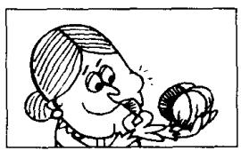
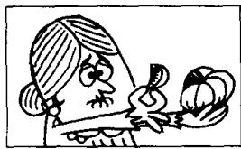

## Lesson 104 Too, very, enough 太、非常、足够

Listen to the tape and answer the questions.

听录音并回答问题。

I could answer the questions.

They were very easy.

I couldn't answer the questions.

They were too difficult.

The questions were easy enough for me to answer.

The questions were too difficult for me to answer.

A  
  
B  
answer all the questions

  
C  
difficult

  
D  
clever  
easy

  
answer all the questions  
stupid

  
buy the car

  
H

  
cheap  
expensive  
eat the cakes  
fresh  
stale

  
hear the stereo

  
climb the wall

loud

low

low

M

  
soft

N

high

  
eat the pear  
hard

0

  
sweet  
eat the orange

P

  
sour

## New words and expressions 生词和短语

clever /'klevə/ adj. 聪明的

loud /laʊd/ adj. 大声的

stupid /'stjuːpɪd/ adj. 笨的

high /haɪ/ adj. 高的

cheap /tʃiːp/ adj. 便宜的

hard /hɑːd/ adj. 硬的

expensive /ɪkˈspensɪv/ adj. 贵的

sweet /swiːt/ adj. 甜的

fresh /freʃ/ adj. 新鲜的

stale /steɪl/ adj. 变馊的

soft /spft/ adj. 软的

low /ləʊ/ adj. 低的，矮的

sour /saʊə/ adj. 酸的

## Written exercises 书面练习

A Complete these sentences using too, very or enough.

完成以下句子，用 too, very 或 enough 填空。

I couldn't speak to the boss. He was \_\_\_\_ busy.

2 I couldn't go out. It was \_\_\_\_ cold for me to go out.

3 I could answer all the questions. They were \_\_\_\_ easy.

4 Is that suitcase light \_\_\_\_ for you to carry?

5 Is your brother old \_\_\_\_ to be a member of our association?

6 They couldn't see that film. They were \_\_\_\_ young.

B Answer these questions.

模仿例句回答以下问题。

## Examples:

Could he answer all the questions? (Yes/easy)

Yes, he could. They were easy enough for him to answer.

Could he answer all the questions? (No/difficult)

No, he couldn't. They were too difficult for him to answer.

1 Could he buy the car? (Yes/cheap)

2 Could he buy the car? (No/expensive)

3 Could they eat the cakes? (Yes/fresh)

4 Could they eat the cakes? (No/stale)

5 Could they hear the stereo? (Yes/loud)

6 Could they hear the stereo? (No/low)

7 Could he climb the wall? (Yes/low)

8 Could he climb the wall? (No/high)

9 Could she eat the pear? (Yes/soft)

10 Could she eat the pear? (No/hard)

11 Could she eat the orange? (Yes/sweet)

12 Could she eat the orange? (No/sour)
