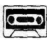

## Lesson 105 Full of mistakes 错误百出

Listen to the tape then answer this question. What was Sandra's present? 听录音，然后回答问题。给桑德拉的礼物是什么？

THE BOSS: Where's Sandra, Bob?
I want her.

BOB: Do you want to speak to her?

THE BOSS: Yes, I do.  
I want her to come to my office.  
Tell her to come at once.

SANDRA : Did you want to see me?

THE BOSS : Ah, yes, Sandra.
How do you spell ‘intelligent’?
Can you tell me?

SANDRA: I-N-T-E-L-L-I-G-E-N-T.

THE BOSS : That's right.
You've typed it with only one 'L'.
This letter's full of mistakes.
I want you to type it again.

SANDRA: Yes, I'll do that.  
I'm sorry about that.

THE BOSS: And here's a little present for you.

SANDRA: What is it?

THE BOSS: It's a dictionary. I hope it'll help you.

## New words and expressions 生词和短语

spell /spel/ (spelt /spelt/, spelt) v. 拼写

present /'prezənt/ n. 礼物

intelligent /ɪnˈtelɪdʒənt/ adj. 聪明的，有智慧的

dictionary /'dɪkʃənəri/ n. 词典

mistake /mɪˈsteɪk/ n. 错误

## Notes on the text 课文注释

1 Do you want to speak to her?

在这句话中，to speak 是动词 want 的宾语，而这个结构——动词原形前加 to——在英文中被称为动词不定式。本课用动词不定式作宾语的例句还有：

I want her to come to my office;

Tell her to come at once;

Did you want to see me;

I want you to type it again 等。

2 full of ..., 充满了……。

3 And here's...。

这里 and 表示承上启下，使上下文紧密联系，当 “于是”，“因此” 讲。

## 参考译文

老板：鲍勃，桑德拉在哪儿？我要找她。

鲍勃：您要同她谈话吗？

老板：是的，我要她到我的办公室来。叫她马上就来。

桑德拉：您找我吗？

老板：啊，是的，桑德拉。“intelligent”怎样拼写？你能告诉我吗？

桑德拉：I—N—T—E—L—L—I—G—E—N—T。

老板：对的。但你只打了1个“L”。这封信里错误百出。我要你重打一遍。

桑德拉：是，我重打。对此我感到很抱歉。

老板：这里有一件小礼物送你。

桑德拉：是什么？

老板：是本词典。我希望它能对你有所帮助。
