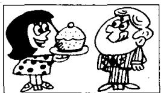
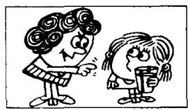
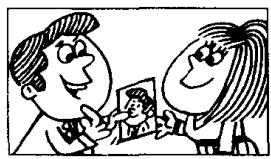
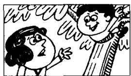
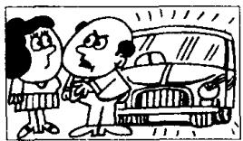

# Lesson 106 I want you/him/her/them to ... 我要你／他／她／他们…… Tell him/her/them to ... 告诉他／她／他们……

L  
U  
S  
O  
T  

Listen to the tape and answer the questions.
听录音并回答问题。

  
carry it

  
correct it

M  
  
listen to it

  
describe it

  
move it

P  
  
try it

Q  
  
finish it

  
keep it

I don't want you/him/her/them to ... 我不要你／他／她／他们……
Tell him/her/them not to ... 告诉他／她／他们不要……

  
hurt yourself

  
slip

  
fall

  
miss it

  
break it  
drive it

  
lose it

  
cut yourself

## New words and expressions 生词和短语

carry /'kæri/ v. 携带 correct /kə'rekt/ v. 改正，纠正
keep /kiːp/ v. 保存，保留

## Written exercises 书面练习

A Rewrite these sentences.

模仿例句将以下祈使句改写成带有动词不定式的陈述句：

Example:

Please repair it. I want you to repair it.

1 Please spell it. 3 Please wear it. 5 Please tell them.

2 Please telephone him. 4 Please ask her. 6 Please help us.

B Write questions and answers.
模仿例句改写以下句子。

Example:

Type it again!
What do you want me to do? I want you to type it again.

What do you want me to do? I want you to type it again.  
1 Carry it! 3 Listen to it! 5 Move it! 7 Finish it!  
2 Correct it! 4 Describe it! 6 Try it! 8 Keep it!

C Rewrite these sentences.
模仿例句改写以下句子，注意不定式的否定形式。

Example:

Don't type it again! (He/her)  
He is telling her not to type it again. He doesn't want her to type it again.

1 Don't hurt yourself! (She/him) 3 Don't fall! (She/him) 5 Don't break it! (She/him)

2 Don't slip! (She/him) 4 Don't miss it! (She/them) 6 Don't drive it! (He/her)

D Answer these questions.
模仿例句回答以下问题。

Example:

Why is he speaking to her? (type it again) Because he doesn't want her to type it again.

1 Why is she speaking to him? (hurt himself)

4 Why is she speaking to them? (miss it)

2 Why is she speaking to him? (slip) 5 Why is she speaking to him? (break it)

3 Why is she speaking to him? (fall) 6 Why is he speaking to her? (drive it)
