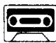
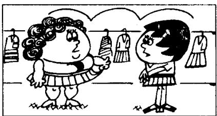

## Lesson 107 It's too small. 太小了。

Listen to the tape then answer this question.

What kind of dress does the lady want?

听录音，然后回答问题。这位女士想要什么样的服装？

ASSISTANT : Do you like this dress, madam?

LADY: I like the colour very much. It's a lovely dress, but it's too small for me.

ASSISTANT: What about this one? It's a lovely dress. It's very smart. Short skirts are in fashion now. Would you like to try it?

LADY : All right.

LADY : I'm afraid this green dress is too small for me as well. It's smaller than the blue one.

LADY : I don't like the colour either. It doesn't suit me at all. I think the blue dress is prettier.

LADY : Could you show me another blue dress?
I want a dress like that one, but it must be my size.

ASSISTANT: I'm afraid I haven't got a larger dress. This is the largest dress in the shop.

## New words and expressions 生词和短语

as well /əz-'wel/ 同样

madam /'mædəm/ n. 夫人，女士（对妇女的尊称） suit /suːt/ v. 适于

smart /smɑːt/ adj. 漂亮的 pretty /'prɪti/ adj. 漂亮的

## Notes on the text 课文注释

1 madam, 是对妇女的一种尊称，服务行业的人员常用此称呼；同时，对于不知姓名的女士也可以用此来表示尊重。这个单词也可拼作 ma'am /mæm/.

2 Would you like ...? 你愿意……吗？用来表示委婉的请求或提议。

3 It's smaller than the blue one. 它比那套蓝色的小一些。

在英文中，当我们把一个人或物与另一个人或物进行比较时，就要用形容词的比较级。大多数单音节的形容词的比较级是在原级后面加上 -er，如 small — smaller, large — larger；有些以 -y 结尾的双音节形容词，如果 -y 前面是一个辅音字母，变比较级时就要把 -y 先变为 -i，然后再加 -er，如 pretty — prettier。

如果在句子中提到了对比的双方，就必须在比较级后面加上 than，如 It's smaller than the blue one. 如果形容词比较级所指很清楚，比较级也可以独立存在，如 I haven't got a larger dress.

## 4 Could you...?

用在表示请求，比 Can you ...? 更婉转客气。

例：Could you tell me the way to the post office?

请你告诉我去邮局怎么走好吗？

5 This is the largest dress in the shop. 这是店里最大的一件衣服。

句中使用了形容词的最高级，它是在形容词原级后面加上 -est，在最高级形容词之前要加定冠词 the。最高级用在将一个人或物与其他一个以上的人或物作比较时。

## 参考译文

店员：夫人，您喜欢这件衣服吗？

女士：我很喜欢这颜色。这是件漂亮的衣服，可是对我来说太小了。

店员：这件怎么样？这是件漂亮的衣服，它很时髦。短裙现在很流行。您要试一试吗？

女士：好吧。

女士：恐怕这件绿色的我穿着也太小了。它比那件蓝色的还要小。

女士：我也不喜欢这种颜色。这颜色我穿根本不合适。我认为那件蓝色的更漂亮些。

女士：您能再给我看一件蓝色的吗？我想要一件和那件一样的，但必须是我的尺寸。

店员：恐怕没有更大的了。这是店里最大的一件。
