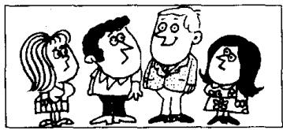
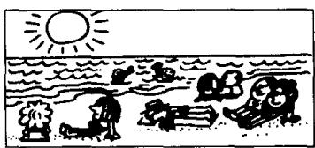
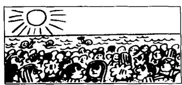
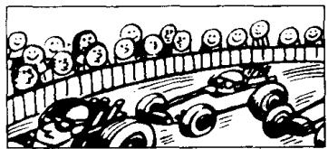
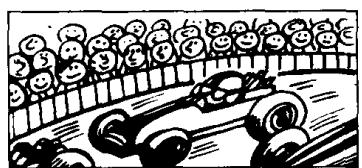
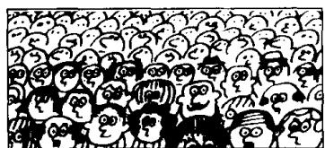
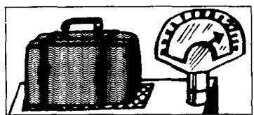

## Lesson 108 How do they compare? 它们的比较级和最高级是什么？

Listen to the tape and answer the questions.
听录音并回答问题。

A  
  
Sophie is tall.

B  
  
Paul is taller
than Sophie.

C  
  
Hans is the tallest
student in our class.

D  
  
It is hot today.

E  
  
It was hotter
yesterday.

F  
  
The day before yesterday was the hottest day in the year.

G  
  
There was a large crowd at the race last year.

H  
  
I  
This year the
crowd is larger.

  
It is the largest
crowd I have ever seen.

J  
  
The brown suitcase is heavy.

K  
  
L  
The blue suitcase
is heavier than
the brown one.

  
The green suitcase is the heaviest of them all.

## Written exercises 书面练习

A Look at these words.

注意这些形容词的比较级形式。

cold — colder; nice — nicer; hot — hotter; heavy — heavier

Now complete these sentences.

模仿例句完成以下句子。

## Example:

It is warm today, but it was \_\_\_\_ yesterday.

It is warm today, but it was warmer yesterday.

1 It is cool today, but it was \_\_\_\_ yesterday.

2 It is wet today, but it was \_\_\_\_ yesterday.

3 He's late again today, but he was \_\_\_\_ yesterday.

4 This test is easy, but that one is \_\_\_\_.

5 This bookcase is large, but that one is \_\_\_\_.

B Write new sentences.

模仿例句改写以下句子。

## Example:

I am very young.

I am younger than you are.

I am the youngest in the class.

I am very old.

3 I am very lazy.

2 I am very tall.

5 I am very lucky.

4 I am very heavy.

7 I am very thin.

6 I am very fat.

8 I am very big.

C Write new sentences.

模仿例句改写以下句子。

Example:

This policeman is tall.

But that policeman is taller.

He is the tallest policeman I have ever seen.

1 This street is clean.

3 This river is long.

5 This knife is blunt.

2 This man is old.

4 This woman is short.

6 This car is cheap.
