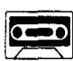
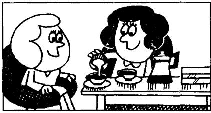
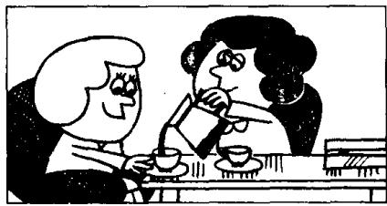
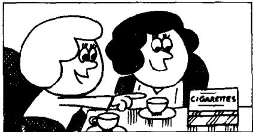
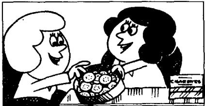

## Lesson 109 A good idea 好主意

Listen to the tape then answer this question.

What does Jane have with her coffee?

听录音，然后回答问题。喝咖啡时简吃了什么？

CHARLOTTE : Shall I make some coffee, Jane?

JANE: That's a good idea, Charlotte.

CHARLOTTE: It's ready.  
Do you want any milk?

JANE : Just a little, please.

CHARLOTTE: What about some sugar? Two teaspoonfuls?

JANE : No, less than that.
One and a half teaspoonfuls, please.
That's enough for me.

JANE : That was very nice.

CHARLOTTE: Would you like some more?

JANE : Yes, please.

JANE : I'd like a cigarette, too. May I have one?

CHARLOTTE: Of course. I think there are a few in that box.

JANE : I'm afraid it's empty.

CHARLOTTE: What a pity!

JANE: It doesn't matter.

CHARLOTTE: Have a biscuit instead.
Eat more and smoke less!

JANE: That's very good advice!

## New words and expressions 生词和短语

idea /aɪˈdɪə/ n. 主意

a few /ə-ˈfjuː/ 几个（用于可数名词之前）

a little 少许（用于不可数名词之前）

pity /'pɪti/ n. 遗憾

teaspoonful /'ti:spu:nfʊl/ n. 一满茶匙

instead /ɪnˈsted/ adv. 代替

less /les/ adj. (little 的比较级) 较少的，更小的

advice /əd'vaɪs/ n. 建议，忠告

## Notes on the text 课文注释

1 less than that, 意思是 “比那稍微少一些”，其中的 that 指上文中的 two teaspoonfuls。

2 I'd = I would; I'd like ..., 我想要……。

3 What a pity! 真遗憾。英语中常用 “What a + 可数名词” 和 “What + 不可数名词” 的结构来表示感叹。

## 参考译文

夏洛特：我来煮点咖啡好吗，简？

简：这是个好主意，夏洛特。

夏洛特：咖啡好了，你要放点奶吗？

简：请稍加一点。

夏洛特：加些糖怎么样？两茶匙行吗？

简：不，再少一些。请放一勺儿半。那对我已足够了。

简：太好了。

夏洛特：你再来点吗？

简：好的，请再来一点。

简：我还想抽枝烟。可以给我一枝吗？

夏洛特：当然可以。我想那个盒子里有一些。

简：恐怕盒子是空的。

夏洛特：真遗憾！

简：没关系。

夏洛特：那就吃块饼干吧。多吃点，少抽点！

简：这是极好的忠告啊！

have.

Have you got any chocolate?
