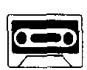
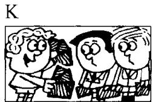
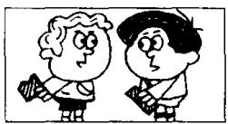
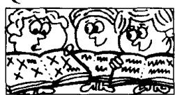
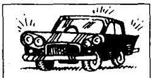
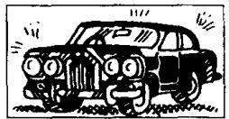
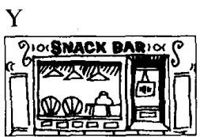

# Lesson 110 How do they compare? 它们的比较级和最高级是什么？

M  
I  

Listen to the tape and answer the questions.

听录音并回答问题。

  
J  
Have you got any chocolate?

  
I've got more than you have.

  
I haven't got much.  
I've got the most.

  
I've got very little.  
I've got less than you have.

N  
  
I've got the least.

O  

P  

Q  
  
Have you made any mistakes?  
I've made more than you  
I've made the most.  
I haven't made many.

W  
R  
  
Have you made any mistakes?

S  
  
I've made fewer than you

  
I've made the fewest.  
I've made very few.  
have.

U  
  
You must see my new car.  
It's very good.

V  
  
This one's better.

  
This one's the best  
I've ever seen.

X  
  
You mustn't go to that restaurant.  
It's very bad.

  
This one's worse.

Z  
  
This one's the worst  
I've ever seen.

## New words and expressions 生词和短语

most /məʊst/ adj. （many, much 的最高级）最多的 worse /wɜːs/ adj. （bad 的比较级）更坏的 least /liːst/ adj. （little 的最高级）最小的，最少的 worst /wɜːst/ adj. （bad 的最高级）最坏的 best /best/ adj. （good 的最高级）最好的

## Written exercises 书面练习

A Complete these sentences using much, many, less or fewer.

完成以下句子，用 much, many, less 或 fewer 填空。

I haven't got any pens. I haven't got \_\_\_\_ either.

2 I've got some money. I've got \_\_\_\_ than you have.

3 I haven't got any money. I haven't got \_\_\_\_ either.

4 I've got some books. I've got \_\_\_\_ than you have.

B Answer these questions.

模仿例句回答以下问题。

## Examples:

Have you got any coffee? — I haven't got much coffee. I've got very little.

Have you got any biscuits? — I haven't got many biscuits. I've got very few.

1 Have you got any jam?

3 Have you got any oranges?

2 Have you got any potatoes?

5 Have you got any meat?

4 Have you got any vegetables?

6 Have you got any money?

## C Write new sentences.

模仿例句将以下句子改成比较级。

Example:

I've got some coffee.

I've got more coffee than you have.

1 I've got some soap.

3 I've got some books.

2 I've got some fruit.

5 I've got some eggs.

4 I've got some presents.

6 I've got some stationery.

## D Write new sentences.

模仿例句改写以下句子。

Examples:

I've got some coffee. — I've got less coffee than you have. I've got the least.

I've got some biscuits. — I've got fewer than you have. I've got the fewest.

I've got some jam.

3 I've got some vegetables.

5 I've got some meat.

2 I've got some potatoes.

4 I've got some oranges.

6 I've got some money.
