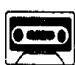
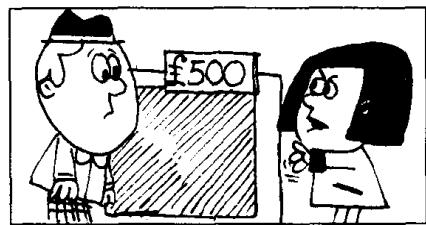
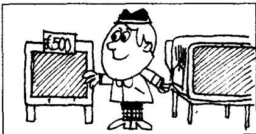
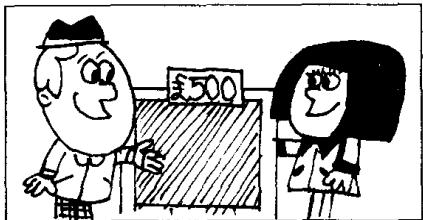

## Lesson 111 The most expensive model 最昂贵的型号

Listen to the tape then answer this question.

Can Mr. Frith buy the television on instalments? How does it work?

听录音，然后回答问题。弗里斯先生可以用分期付款的方式购买电视机吗？如何操作呢？

MR. FRITH : I like this television very much.
How much does it cost?

ASSISTANT: It's the most expensive model in the shop. It costs five hundred pounds.

MRS. FRITH: That's too expensive for us. We can't afford all that money.

ASSISTANT: This model's less expensive than that one. It's only three hundred pounds. But, of course, it's not as good as the expensive one.

MR. FRITH: I don't like this model.
The other model's more expensive,
but it's worth the money.

MR. FRITH: Can we buy it on instalments?

ASSISTANT: Of course.
You can pay a deposit of thirty pounds,
and then fourteen pounds a month
for three years.

MR. FRITH: Do you like it, dear?

MRS. FRITH: I certainly do,
but I don't like the price.
You always want the best,
but we can't afford it.
Sometimes you think
you're a millionaire!

MR. FRITH: Millionaires don't buy things on instalments!

## New words and expressions 生词和短语

model /'modl/ n. 型号，式样 instalment /ɪnˈstɔːlmənt/ n. 分期付款

afford /ə'fɔːd/ v. 付得起（钱） price /praɪs/ n. 价格

deposit /dɪˈpɒzɪt/ n. 预付定金 millionaire /ˌmɪljəˈneə/ n. 百万富翁

## Notes on the text 课文注释

1 大多数两个以上音节的形容词可与 more/less 连用构成其比较级形式，与 most/least 连用构成其最高级形式，如本课中的几个例子：This model's less expensive than that one; The other model's more expensive; It's the most expensive model in the shop.

2 it's not as good as the expensive one, 它不如那种价格高的好。not as ... as ... 可以用来进行比较，意思是，放在前面的人或物在程度上低于后面的人或物。

3 buy ... on instalments, 以分期付款的方式购买。

## 参考译文

弗里斯先生：我非常喜欢这台电视机。请问它多少钱？

店员：这是店里最贵的型号。它的售价是500英镑。

弗里斯夫人：这对我们来说是太贵了。我们花不起那么多钱。

店员：这种型号的比那种要便宜些。它只要300英镑。但是，它当然没有价钱高的那种好。

弗里斯先生：我不喜欢这种型号。那一种型号价格是贵一些，但它值这么多钱。

弗里斯先生：我们可以用分期付款的方式购买吗？

店员：当然可以。您可以先付30英镑定金，然后每月14镑，3年付清。

弗里斯先生：你喜欢吗，亲爱的？

弗里斯夫人：我当然喜欢，但是我不喜欢这个价钱。你总是要买最好的，可我们买不起。有时候你认为自己是个百万富翁！

弗里斯先生：百万富翁是不会分期付款买东西的！

This test is
more difficult.
