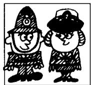
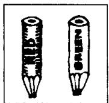
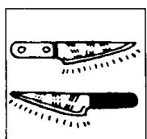
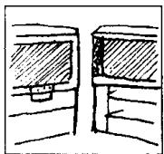
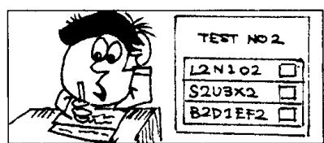

# Lesson 112 How do they compare? 它们的比较级和最高级是什么？

0  
1  
e  

Listen to the tape and answer the questions.

听录音并回答问题。

  
sweet

  
tall

  
short

d  
  
old

  
blunt

  
sharp

g

  
clean

  
fat

  
smart

  
light

k  
  
new

  
expensive

m

  
This test is
difficult.

n

  
This is the most difficult test I have ever done!

  
This book is  
interesting.

q  
  
This book is less interesting.

r  
  
This is the least interesting book I have ever read!

## Written exercises 书面练习

A Complete these sentences.
模仿例句完成以下句子。

Examples:

This dress is long, but that one is \_\_\_\_.

This dress is long, but that one is longer.

Tom is intelligent, but Bill is \_\_\_\_.

Tom is intelligent, but Bill is more intelligent.

1 This book is cheap, but that one is \_\_\_\_.

2 This book-is expensive, but that one is \_\_\_\_.

3 This question is easy, but that one is \_\_\_\_.

4 This question is difficult, but that one is \_\_\_\_.

## B Write questions and answers.

模仿例句提问并回答。

Example:

green apple/sweet/red apple

Is the green apple as sweet as the red apple?

No, it isn't. The green apple isn't as sweet as the red apple.

1 policeman/tall/policewoman

3 boy/old/girl

5 blue car/clean/red car

2 man/short/woman

4 red pencil/blunt/green pencil

6 woman/fat/man

C Write new sentences.
模仿例句改写以下句子。

Examples:

This test is less difficult. (ever done)

No, it isn't. It is more difficult.

It's the most difficult test I've ever done.

My book is more interesting than yours. (ever read)

No, it isn't. It is less interesting.

It's the least interesting book I've ever read.

1 My radio is less expensive than yours. (ever seen)

2 Tom is less intelligent than Bill. (person/ever met)

3 My book is less interesting than yours. (ever read)

4 This test is more difficult. (ever done)
