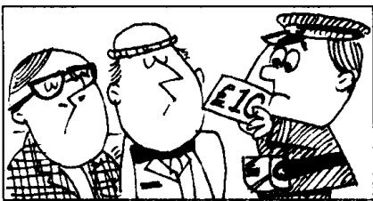
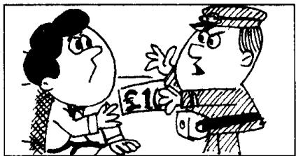
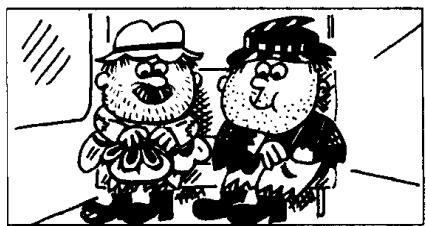

## Lesson 113 Small change 零钱

Listen to the tape then answer this question.

Who has got some small change?

听录音，然后回答问题。谁有零钱？

CONDUCTOR : Fares, please!

MAN : Trafalgar Square, please.

CONDUCTOR : I'm sorry, sir.  
I can't change a ten-pound note.  
Haven't you got  
any small change?

MAN : I've got no small change, I'm afraid.

CONDUCTOR : I'll ask some of the passengers.

CONDUCTOR : Have you any small change, sir?

1st PASSENGER: I'm sorry.  
I've got none.

2nd PASSENGER: I haven't got any either.

CONDUCTOR : Can you change
this ten-pound note, madam?

3rd PASSENGER: I'm afraid I can't.

4th PASSENGER : Neither can I.

CONDUCTOR : I'm very sorry, sir.
You must get off the bus.
None of our passengers
can change this note.
They're all millionaires!

TWO TRAMPS : Except us.

1st TRAMP: I've got some small change.

2nd TRAMP: So have I.

## New words and expressions 生词和短语

conductor /kən'dʌktə/ n. 售票员

none /nʌn/ pron. 没有任何东西

fare /feə/ n. 车费，车票

neither /'naɪðə/ adv. 也不

change /tʃeɪndʒ/ v. 兑换（钱）

get off 下车

note /nəʊt/ n. 纸币

tramp /træmp/ n. 流浪汉

passenger /'pæsɪndʒə/ n. 乘客

except /ɪkˈsept/ prep. 除……外

## Notes on the text 课文注释

1 Fares, please! 请买票！这是公共车辆售票员用语。

2 Trafalgar Square, 特拉法加广场，位于伦敦市区。

3 I've got no small change, 我没有一点零钱。no + 名词表示所指的东西全然没有，以上这句话比“I haven't got any small change.”更强调没有任何一点零钱。

4 I've got none. 这里是指零钱（不可数名词）。none 也可与可数名词连用，如 none of our passengers can change this note.

5 Neither can I.

当有人说了一句否定意义的话，其否定的内容也适于你或另外的人或事物时，可以采用这种简略的句式。注意这种简略句式中主语和动词（包括 be）的顺序。

6 get off the bus, 下车。

7 So have I.

当有人说了一句肯定意义的话，其肯定的内容也适于你或另外的人或事物时，可以采用这种简略的句式。注意这种简略句式中主语和动词（包括 be）的顺序。

## 参考译文

售票员：请买票！

男子：请买一张到特拉法加广场的票。

售票员：对不起，我找不开10英镑的钞票。您没有零钱吗？

男子：恐怕我没有零钱。

售票员：我来问问其他乘客。

售票员：先生，您有零钱吗？

乘客 1：对不起，我没有。

乘客 2：我也没有。

售票员：夫人，您能把这10英镑的钞票换开吗？

乘客 3：恐怕不能。

乘客 4：我也不能。

售票员：非常抱歉，先生。您必须下车。我们的乘客中没人能换开这张钞票。他们都是百万富翁！

二流浪汉：我们俩除外。

流浪汉1：我有零钱。

流浪汉 2：我也有。
