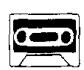
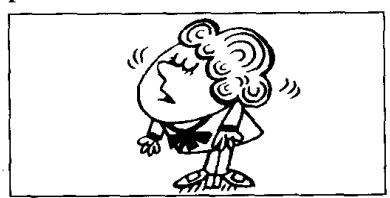
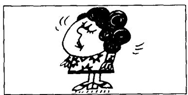
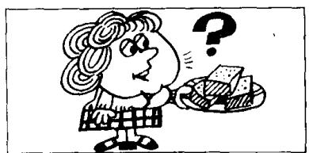
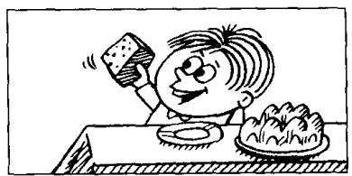
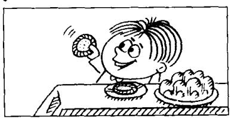
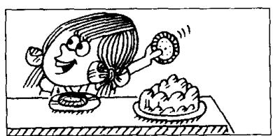

## Lesson 114 I've got none. 我没有。

0  
V  

Listen to the tape and answer the questions.
听录音并回答问题。

  
Have you got any chocolate?

p  
  
I haven't got any.  
I've got no chocolate.  
I've got none.

q  
  
I haven't any either. Neither have I.

  
Have you got any envelopes?

  
I haven't got any.  
I've got no envelopes.  
I've got none.

  
I haven't any either. Neither have I.

  
Have you got any cake?

  
I've got some.

  
So have I.

  
Have you got any
biscuits?

y  
  
I've got some.

z  
  
So have I.

## Written exercises 书面练习

A Rewrite these sentences. 模仿例句改写以下句子，用 no 来表示否定：

Example:

There isn't any milk in that bottle. There is no milk in that bottle.

1 There aren't any books on that shelf. 3 There isn't any coffee in this tin.  
2 I haven't got any money. 4 I didn't see any cars in the street.

B Answer these questions.
模仿例句回答以下问题。

Example:

Have you got any beer?
No, I haven't got any beer.
I've got no beer. I've got none.

1 Have you got any milk? 3 Have you got any magazines?  
2 Have you got any envelopes? 4 Have you got any bread?

C Write new sentences.
模仿例句完成以下句子。

Example:

I'm not tired. Neither am I. I'm not tired, either.

1 I'm not hungry. 3 I wasn't at church yesterday. 5 I can't swim.  
2 I didn't meet him. 4 I don't like ice cream. 6 I'm not a doctor.

D Write new sentences.
模仿例句完成以下句子。

Example:

I'm tired.
So am I. I'm tired, too.

1 I'm hungry. 3 I was at church yesterday. 5 I can swim.

2 I met him. 4 I like ice cream. 6 I'm a doctor.
