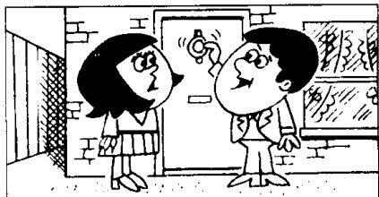
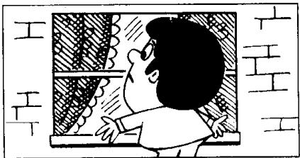
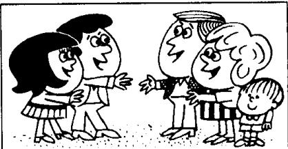
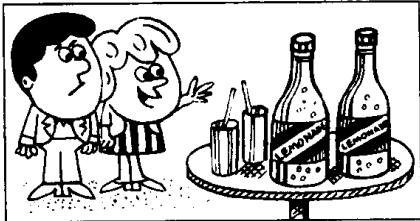

## Lesson 115 Knock, knock! 敲敲门!

Listen to the tape then answer this question. What does Jim have to drink? 听录音，然后回答问题。吉姆只能喝什么饮料？

HELEN: Isn't there anyone at home?

JIM : I'll knock again, Helen.
Everything's very quiet.
I'm sure there's no one at home.

HELEN: But that's impossible.  
Carol and Tom invited us to lunch.  
Look through the window.

HELEN : Can you see anything?

JIM : Nothing at all.

HELEN: Let's try the back door.

JIM: Look! Everyone's in the garden.

CAROL : Hello, Helen. Hello, Jim.

TOM : Everybody wants to have lunch in the garden. It's nice and warm out here.

CAROL : Come and have something to drink.

JIM : Thanks, Carol.
May I have a glass of beer please?

CAROL: Beer?
There's none left.
You can have some lemonade.

JIM : Lemonade!

TOM: Don't believe her, Jim.  
She's only joking.  
Have some beer!

## New words and expressions 生词和短语

anyone /'eniwʌn/ pron. （用于疑问句，否定式）
任何人

invite /ɪnˈvaɪt/ v. 邀请

anything /'eniθɪŋ/ pron. 任何东西

knock /nɒk/ v. 敲，打

nothing /'nʌθɪŋ/ pron. 什么也没有

everything /'evriθɪŋ/ pron. 一切事物

lemonade /ˌleməˈneɪd/ n. 柠檬水

quiet /'kwaɪət/ adj. 宁静的，安静的

joke /dʒəʊk/ v. 开玩笑

impossible /ɪmˈpɒsɪbəl/ adj. 不可能的

## Notes on the text 课文注释

1 Isn't there anyone at home? 家里没人吗？在英语中，由 some, any, no, every 与 -one, -thing 组成的复合词，起代词作用，常被称为不定代词，这是因为我们常常不清楚其所指的是谁或什么。

2 nice and ...

用于形容词或副词前以加强语气。一般表示褒义，但有时也用于贬义。

3 There's none left. 一点儿都没剩下。

句中的 left 是个过去分词，用来修饰 none。

## 参考译文

海伦：家里没有人吗？

吉姆：海伦，我再敲一次。毫无动静，肯定家里没有人。

海伦：但这是不可能的。卡罗尔和汤姆请我们来吃午饭。从窗子往里看看。

海伦：你能看见什么吗？

吉姆：什么也看不见。

海伦：让我们到后门去试试。

吉姆：瞧！大家都在花园里。

卡罗尔：你好，海伦。你好，吉姆。

汤姆：大家都想在花园里吃午饭。这外面挺暖和。

卡罗尔：来喝点什么。

吉姆：谢谢，卡罗尔。给我一杯啤酒好吗？

卡罗尔：啤酒？一点都不剩了。你可以喝点柠檬水。

吉姆：柠檬水！

汤姆：吉姆，别信她的。她只是在开玩笑。喝点啤酒吧！

Everyone is asleep.
Everybody is asleep.
