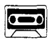
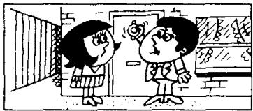
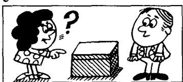
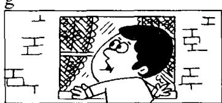
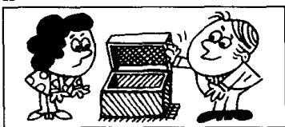
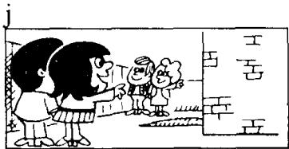

## Lesson 116 Every, no, any and some 每一、无、若干和一些

b  
c  

Listen to the tape and answer the questions.

听录音并回答问题。

<table><tr><td>Every</td><td>None</td><td>Any</td><td>Some</td></tr><tr><td>Everyone</td><td>No one</td><td>Anyone</td><td>Someone</td></tr><tr><td>Everybody</td><td>Nobody</td><td>Anybody</td><td>Somebody</td></tr><tr><td>Everything</td><td>Nothing</td><td>Anything</td><td>Something</td></tr><tr><td>Everywhere</td><td>Nowhere</td><td>Anywhere</td><td>Somewhere</td></tr></table>

a  

  
Everything is untidy.

  
I looked for my pen  
everywhere.

e  
f  
k  
d  
  
Is there anyone

at home?

  
Is there anything  
in that box?

  
I couldn't find my pen  
anywhere.  
Is there anybody at home?

  
There's no one

i  
h  
  
at home.  
There's nobody  
at home.  
There's nothing

  
in this box.  
Where did you go  
yesterday?
Nowhere. I stayed
at home.

  
There's someone  
in the garden.

  
There's something  
under that chair!

  
My glasses must be  
somewhere!
You're wearing them!

There's somebody

in the garden.
235

## New words and expressions 生词和短语

asleep /əˈsliːp/ adj. 睡觉，睡着（用作表语） glasses /ˈɡlaːsɪz/ n. 眼镜

## Written exercises 书面练习

A Rewrite these sentences.
模仿例句改写以下句子：

## Example:

I didn't buy anything. I bought nothing.
1 I didn't do anything. 2 I didn't see anyone. 3 I didn't go anywhere. 4 I didn't meet anybody.

B Answer these questions using any/no with -one, -body, -thing, -where. 模仿例句回答以下问题。

Example:

Did you see anyone?
No, I didn't see anyone. I saw no one.
1 Did you hear anything? 3 Did you go anywhere? 5 Did you write to anybody?
2 Did you speak to anyone? 4 Did you buy anything? 6 Did you meet anyone?

C Rewrite these sentences.
模仿例句改写以下句子。

## Example:

They're all watching television. Everyone's watching television.

2 They're all hurrying to work. 4 They're all drinking lemonade.

D Answer these questions.
模仿例句回答以下问题。

## Example:

Have you got anything to wear? — No, I haven't got anything to wear. I've got nothing to wear.

What about Penny? — She's got something to wear.

1 Have you got anything to eat? What about Sam?

2 Have you got anything to do? What about the children?

3 Have you got anything to drink? What about Jane?

4 Have you got anything to read? What about Alan?
