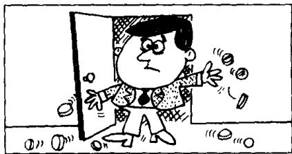

## Lesson 117 Tommy's breakfast 汤米的早餐

Listen to the tape then answer this question.

What does she mean by ‘change’ in the last sentence?

听录音，然后回答问题。最后一句话中的“change”是什么意思？

When my husband was going into the dining room this morning, he dropped some coins on the floor.

There were coins everywhere.
We looked for them,
but we could not find them all.

  
While we were having breakfast,
our little boy, Tommy,
found two small coins on the floor.

He put them both into his mouth.  
We both tried to get the coins,  
but it was too late.  
Tommy had already swallowed them!

Later that morning,
when I was doing the housework,
my husband phoned me
from the office.

‘How’s Tommy?’ he asked.
‘I don’t know,’ I answered,
‘Tommy’s been to the toilet
three times this morning,
but I haven’t had any change yet!’

## New words and expressions 生词和短语

dining room 饭厅

swallow /'swɒləʊ/ v. 吞下

coin /kɔɪn/ n. 硬币

later /'leɪtə/ adv. 后来

mouth /maʊθ/ n. 嘴

toilet /'tɔɪlɪt/ n. 厕所，盥洗室

## Notes on the text 课文注释

1 在英文中表示过去某时正在进行的动作，要用过去进行时。与现在进行时相比，过去进行时的区别就在于要用 be 的过去式。过去进行时的例子有：When my husband was going into the dining room this morning ...；While we were having breakfast ... 等。

2 .them all, all 用来强调每一个硬币。从语法上来讲，all 是 them 的同位语。紧跟在一个名词或代词后，进一步说明前面名词或代词是谁或什么东西的名词或代词，叫同位语。

3 our little boy, Tommy,

Tommy 是 boy 的同位语。

4 put them both...

5 we both...

both 是 we 的同位语。

句中用了过去完成时。过去完成时用来表示两个动作中，发生在前的那个动作。显然，句中“咽下硬币”的动作发生在夫妇俩能够把硬币从汤米手中抢过来之前。

7 later that morning, 那天上午的晚些时候。
later 是副词 late 的比较级。

8 any change,

change 是个多义词，既有 “零钱” 的意思，也有 “变化” 的意思。此处既可指 “硬币”，亦可指 “情况的变化”。这是 “双关” 修辞法。

## 参考译文

今天早晨我丈夫走进饭厅时，把一些硬币掉在地上了。

到处都是硬币。我们虽然找了，但没能把它们全部找到。

正当我们吃早饭时，我们的小男孩汤米在地上找到了两枚小硬币。

他把这两枚硬币全都放进了嘴里。我们俩都试图把这两枚硬币拿出来，但太迟了。汤米已经把硬币咽了下去！

那天上午的晚些时候，当我正做家务时，我丈夫从办公室打来电话。

“汤米怎么样？”他问。“我不知道，”我回答说，“今天上午汤米去了3次厕所了，但我还没看到硬币！”
