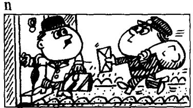
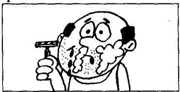

## Lesson 118 What were you doing? 你那时正在做什么？

Listen to the tape and answer the questions.

听录音并回答问题。

  
Someone knocked at the door  
when I was having breakfast.

  
When I was leaving the house,  
the postman arrived.

0  
  
Just as I was opening the  
front door, the telephone rang.

p  
  
She slipped and hurt herself  
while she was getting off the bus.

q  
  
He cut himself

while he was shaving.

  
My wife was cooking the dinner  
while I was working in the garden.

## New words and expressions 生词和短语

ring /rɪŋ/ (rang /ræŋ/, rung /rʌŋ/) v. 响

## Written exercises 书面练习

A Rewrite these sentences using when.
模仿例句用 when 把两个句子合并成一句。

Example:

He arrived. I had a bath. He arrived when I was having a bath.

1 He knocked at the door. I answered the phone.

4 The boss arrived. She typed a letter.

2 He came downstairs. I had breakfast.

5 The train left. I bought the tickets.

3 The phone rang. I washed the dishes.

6 It rained heavily. I drove to London.

## B Answer these questions.

模仿例句回答以下问题。

## Example:

What were you doing when he arrived? (have a bath)

When he arrived I was having a bath.

1 What were you doing when he arrived? (cook a meal)

2 What were you doing when he arrived? (wash the dishes)

3 What were you doing when he arrived? (work in the garden)

4 What were you doing when he arrived? (type letters)

5 What were you doing when he arrived? (shave)

6 What were you doing when he arrived? (boil the milk)

7 What were you doing when he arrived? (phone my sister)

8 What were you doing when he arrived? (dust the bedroom)

C Answer these questions.

模仿例句回答以下问题。

## Example:

What was he doing while you were cooking the dinner?
(work in the garden)

While I was cooking the dinner, he was working in the garden.

1 What was he doing while you were cooking the dinner? (have a wash)

2 What was he doing while you were cooking the dinner? (watch television)

3 What was he doing while you were cooking the dinner? (clean his shoes)

4 What was he doing while you were cooking the dinner?
(listen to the radio)

5 What was he doing while you were cooking the dinner? (change his suit)

6 What was he doing while you were cooking the dinner?
(sit in the dining room)

7 What was he doing while you were cooking the dinner? (read the paper)

8 What was he doing while you were cooking the dinner?
(drive home from work)
