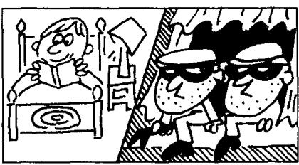

## Lesson 119 A true story 一个真实的故事

Listen to the tape then answer this question.

Who called out to the thieves in the dark?

听录音，然后回答问题。谁在暗处对窃贼喊了一声？

Do you like stories?
I want to tell you a true story.
It happened to a friend of mine a year ago.

While my friend, George, was reading in bed, two thieves climbed into his kitchen.

After they had entered the house,
they went into the dining room.
It was very dark,
so they turned on a torch.

Suddenly, they heard a voice behind them. 'What's up? What's up?' someone called. The thieves dropped the torch and ran away as quickly as they could.

George heard the noise
and came downstairs quickly.

He turned on the light,
but he couldn't see anyone.
The thieves had already gone.

But George's parrot, Henry, was still there.

'What's up, George?' he called.

'Nothing, Henry,' George said and smiled.

'Go back to sleep.'

## New words and expressions 生词和短语

story /'stɔːri/ n. 故事

dark /dɑːk/ adj. 黑暗的

happen /'hæpən/ v. 发生

torch /tɔːtʃ/ n. 手电筒

thief /θiːf/ (复数 thieves /θiːvz/) n. 贼

enter /'entə/ v. 进入

voice /vɔɪs/ n. （说话的）声音

parrot /'pærət/ n. 婴鹉

## Notes on the text 课文注释

I as quickly as they could 是状语，修饰 ran away。第 1 个 as 是副词，第 2 个 as 是连词，引导比较

· 状语从句。could 后省略了 run，是“能跑多快就跑多快”的意思。

2 What's up? 干什么？有什么事？

3 he called,

he 指 parrot。英语中，动物有时用 he 或 she 代替，是“拟人”的写法。

4 go back to sleep, 继续睡觉。

## 参考译文

你喜欢听故事吗？我要告诉你一个真实的故事。这是一年前发生在我的一个朋友身上的故事。

当我的朋友乔治在床上看书时，两个小偷爬进了他的厨房。

他们进到屋里后，走进了饭厅。饭厅里很暗，于是他们打开了手电筒。

突然他们听到身后有声音。“什么事？什么事？”有人叫着。小偷扔下了手电筒，飞快地逃走了。

乔治听到了响声，迅速地下了楼。

他开了灯，但不见一个人。小偷逃走了。

但是乔治的鹦鹉亨利仍在那里。“什么事，乔治？”它叫着。“没事，亨利。”乔治笑着说，“接着睡觉吧。”
