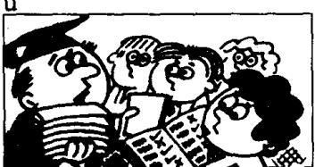

## Lesson 120 It had already happened. 它已经发生了。

Listen to the tape and answer the questions.

听录音并回答问题。

  
I asked the price of the car, but they had already sold it.

  
I ran to the platform quickly, but the train had already left.

  
He gave us our exercise books after he had corrected them.

  
She went on holiday
after she had taken the examination.

  
She had finished the housework before she went out.

  
before they arrived.

## New words and expressions 生词和短语

exercise book /'eksəsaiz-bʊk/ n. 练习本

## Written exercises 书面练习

A Rewrite these sentences using after.
用 after 把两个句子合并为一。

Example:

She went home. She typed the letter.
She went home after she had typed the letter.

1 He dropped the vase. He took it into the living room.

2 He bought another car. He sold his old one.

3 He swept the floor. He dusted everything.

4 She drank the milk. She boiled it.

5 He turned off the television. He saw the programme.

6 He went to bed. He did his homework.

## B Answer these questions.

模仿例句回答以下问题。

## Example:

Have you met him?

Yes, I have just met him. I had never met him before.

1 Have you seen it?

2 Have you read it?

3 Have you tried it?

4 Have you been there?

5 Have you written a letter in English?

6 Have you watched this programme?

## C Answer these questions.

模仿例句回答以下问题。

## Example:

Why didn't you sweep the floor? (She)

It was too late. She had already swept it.

1 Why didn't you paint the bookcase? (He)

2 Why didn't you dust the dressing table? (She)

4 Why didn't you correct it? (You)

3 Why didn't you telephone him? (You)

5 Why didn't you shut the door? (They)

6 Why didn't you make the bed? (She)

## D Write new sentences using after.

模仿例句. 使用 after 改写以下句子。

## Example:

Did you read the book? Yes, but I saw the film first.

I read the book after I had seen the film.

1 Did you go to the doctor? Yes, but I made an appointment first.

2 Did the boss leave the office? Yes, but he finished work first.

3 Did your wife go out? Yes, but she finished the housework first.

4 Did your teacher give you your exercise book? Yes, but he corrected it first.

5 Did your sister go on holiday? Yes, but she took the examination first.

6 Did you buy a new car? Yes, but I sold my old one first.
