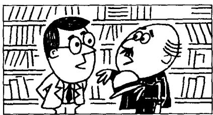
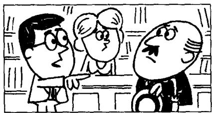
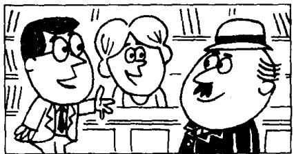

## Lesson 121 The man in a hat 戴帽子的男士

Listen to the tape then answer this question.

Why didn't Caroline recognize the customer straight away?

听录音，然后回答问题。为什么卡罗琳没有马上认出那位顾客？

CUSTOMER: I bought two expensive dictionaries here half an hour ago, but I forgot to take them with me.

MANAGER: Who served you, sir?

CUSTOMER : The lady who is standing behind the counter.

MANAGER: Which books did you buy?

CUSTOMER : The books
which are on the counter.

MANAGER: Did you serve this gentleman half an hour ago, Caroline? He says he's the man who bought these books.

CAROLINE: I can't remember. The man who I served was wearing a hat.

MANAGER: Have you got a hat, sir?

CUSTOMER : Yes, I have.

MANAGER : Would you put it on, please?

CUSTOMER : All right.

MANAGER: Is this the man that you served, Caroline?

CAROLINE: Yes. I recognize him now.

## New words and expressions 生词和短语

customer /'kʌstəmə/ n. 顾客

serve /sɜːv/ v. 照应，服务，接待

forget /fəˈɡet/ (forgot /fəˈɡɒt/, forgotten /fəˈɡɒtn/)

counter /'kauntə/ n. 柜台

v. 忘记

recognize /'rekəgnaɪz/ v. 认出

manager /'mænɪdʒə/ n. 经理

## Notes on the text 课文注释

1 to take them with me 把它们带上。

them 指 “两本词典”。

2 The lady who is standing behind the counter.

这是一个省略句，完整的句子是“The lady who is standing behind the counter served me.”其中 who is standing behind the counter 是一个以关系代词 who 引导的定语从句，用来修饰前面的名词 the lady。本课带有定语从句的复合句还有：The books which are on the counter; He says he’s the man who bought these books: The man who I served was wearing a hat; Is this the man that you served 等，其中 which, who, whom, that 均为关系代词。

3 The man who I served was wearing a hat.

这是另一个定语从句的例子。由于被修饰的名词 the man 在定语从句中是动词 served 的宾语，因此，关系代词应该用宾格 whom，但在口语中往往用主格 who。

## 参考译文

顾客：半小时以前我在这里买了两本很贵的辞典，但是我忘了拿走。

经理：是谁接待您的，先生？

顾客：站在柜台后面的那位女士。

经理：您买的是两本什么书？

顾客：就是柜台上的那两本。

经理：卡罗琳，半小时前你接待过这位先生吗？他说他就是买这两本书的人。

卡罗琳：我记不起来了。我接待的那个人戴着一顶帽子。

经理：先生、您有帽子吗？

顾客：有的，我有帽子。

经理：请您把帽子戴上好吗？

顾客：好吧。

经理：卡罗琳，这就是你接待过的那个人吗？

卡罗琳：是他。我现在认出他来了。
