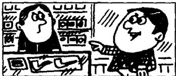
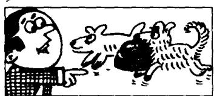

## Lesson 122 Who (whom), which and that 关系代词

Listen to the tape and answer the questions.
听录音并回答问题。

1  
  
Who served you?

2  
  
Who served you?  
The man who/that is standing behind the counter.  
The woman who/that is standing behind the counter.

3  
  
Who is making all  
that noise?
The men who/that are
repairing the road.

4  
  
I served him  
yesterday.
He is the man who(m)/
that I served
yesterday.

5  
  
I served her

6  
  
yesterday.
She is the woman who(m)/that I served yesterday.  
I saw them  
yesterday.
They are the men
who(m)/that I saw
yesterday.

  
Which book did  
you buy?
The book which/that
is on the counter.

8  
  
9  
Which books did  
you buy?
The books which/that
are on the counter.

  
Which dog is yours?
The dog which/that
is carrying that
basket.

## New words and expressions 生词和短语

road /rəʊd/ n. 路

## Written exercises 书面练习

A Rewrite these sentences using who, whom or which.

用 who, whom 或 which 把以下每对句子改写成一句话。

Examples:

She is the girl. She met me yesterday.
She is the girl who met me yesterday.

This is the book. I bought it yesterday.

This is the book which I bought yesterday.

She is the girl. I met her yesterday.
She is the girl who (or whom) I met yesterday.

1 This is the car. The mechanic repaired it yesterday.

5 He is the policeman. He caught the thieves.

2 He is the man. I invited him to the party.

6 She is the nurse. She looked after me.

3 These are the things. I bought them yesterday.

7 She is the woman. I met her at the party.

8 I am the person. I wrote to you.

4 He is the man. He came here last week.

B Write questions and answers.
模仿例句提问并回答。

Example:

He served me.

Who served you? That man?

Yes, he's the man who served me.

1 She met him.

3 She made it.

5 He shut it.

7 He told me.

2 He sat there.

4 He read it.

6 She took it.

8 She saw me.

C Write questions and answers.
模仿例句提问并回答。

Example:

I met him yesterday.

Whom did you meet yesterday? That man?

Yes, he's the man whom I met yesterday.

1 I saw him.

3 I invited him.

5 I found him in the garden. 7 I heard her.

2 I telephoned her. 4 I took him to the cinema. 6 I drove her to London. 8 I remembered him.
