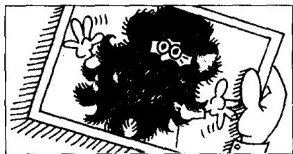
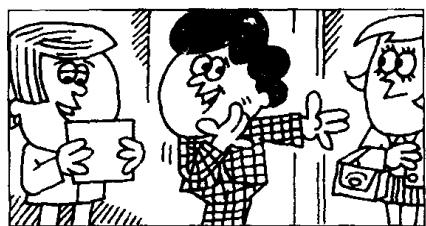

## Lesson 123 A trip to Australia 澳大利亚之行

Listen to the tape then answer this question.

Who is the man with the beard?

听录音，然后回答问题。那个长着络腮胡子的人是谁？

MIKE: Look, Scott.
This is a photograph I took during my trip to Australia.

SCOTT: Let me see it, Mike.

SCOTT: This is a good photograph. Who are these people?

MIKE: They're people I met during the trip.

MIKE: That's the ship we travelled on.  
SCOTT: What a beautiful ship!

SCOTT: Who's this?

MIKE: That's the man I told you about. Remember?

SCOTT: Ah yes.
The one who offered you
a job in Australia.

MIKE: That's right.

SCOTT: Who's this?

MIKE: Guess!

SCOTT: It's not you, is it?

MIKE : That's right.

MIKE: I grew a beard during the trip, but I shaved it off when I came home.

SCOTT: Why did you shave it off?

MIKE: My wife didn't like it!

## New words and expressions 生词和短语

during /'djuərɪŋ/ prep. 在……期间

guess /ges/ v. 猜

trip /trɪp/ n. 旅行

travel /'trævəl/ v. 旅行

grow /grəʊ/ (grew /gruː/, grown /grəʊn/) v. 长，让……生长

offer /'ɒfə/ v. 提供

job /dʒɒb/ n. 工作

beard /bɪəd/ n. （下巴上的）胡子，络腮胡子

## Notes on the text 课文注释

1 This is a photograph I took . . .

这句话中的 I took during my trip to Australia 是一个定语从句，用来修饰 a photograph；由于所修饰的名词在从句中作动词 took 的宾语，因此，引导从句的关系代词 that 往往省略。

2 They're people I met during the trip.

与注 1 的情况相同，关系代词 whom 往往省略。

## 参考译文

迈克：看，这是我到澳大利亚旅行时拍的一张照片。

斯科特：让我看看，迈克。

斯科特：这是一张很好的照片。这些人是谁？

迈克：他们是我旅行时认识的人。

迈克：这是我们所乘的那条船。

斯科特：多漂亮的船啊！

斯科特：这是谁？

迈克：这就是我跟你说过的那个人。还记得吗？

斯科特：啊，记得。就是在澳大利亚给你工作做的那个人。

迈克：对。

斯科特：这是谁？

迈克：你猜！

斯科特：这不是你，对吗？

迈克：不，是我。

迈克：我在旅行时留了胡子，但我回到家时就把它刮了。

斯科特：你为什么把它刮了？

迈克：我妻子不喜欢！
