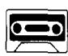
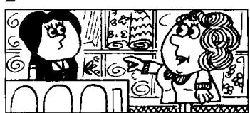
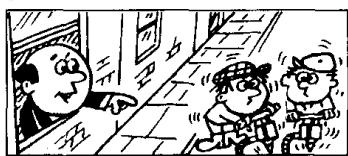
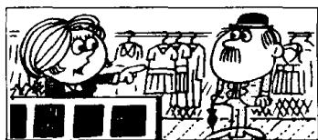
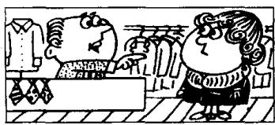
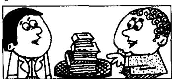
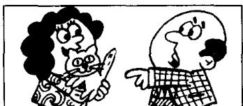

## Lesson 124 (Who) / (whom), (which) and (that) 关系代词

Listen to the tape and answer the questions.
听录音并回答问题。

1  
  
Who served you?  
The man standing
behind the counter.

2  
  
Who served you?  
The woman standing
behind the counter.

3  
  
Who is making all  
that noise?
The men repairing the
road.

4  
  
I served him  
yesterday.
He is the man
I served yesterday.

5  
  
I served her  
yesterday.
She is the woman
I served yesterday.

6  
  
I saw them  
yesterday.
They are the men
I saw yesterday.

7  
  
What's this?  
This is the book
I bought yesterday.

8  
  
What are these?  
These are the books
I bought yesterday.

9  
  
This is the kitten
I found in the garden.

## New words and expressions 生词和短语

kitten /'kɪtn/ n. 小猫

## Written exercises 书面练习

A Rewrite these sentences. 模仿例句把以下每对句子改写成一句话：

## Examples:

She is the girl. I met her yesterday.
She is the girl I met yesterday.
This is the ship. I travelled on it.
This is the ship I travelled on.

1 She is the woman. I drove her to London.

2 That's the film. I saw it.

3 That's the man. I spoke to him.

B Write questions and answers.
模仿例句提问并回答。

This is the book. I bought it yesterday.
This is the book I bought yesterday.

4 They are the thieves. The police caught them.

5 These are the letters. I typed them.

6 These are the people. You asked me about them.

## Example:

I met that man yesterday.
Which man? That man?
Yes, that's the man I met yesterday.

1 I saw that man yesterday.

2 I repaired that car yesterday.

3 I drove that woman to London yesterday.

4 I bought that umbrella yesterday.

5 I took that medicine yesterday.

C Write new sentences.
模仿例句改写以下句子。

6 I invited that man to my house yesterday.

## Example:

This is the film. I told you about it.
That's right. This is the film you told me about.

1 This is the village. I wrote to you about it.

3 This is the test. I spoke to you about it.

2 He is the person. I have heard about him.

4 She is the woman. I read about her.

5 This is something new. I haven't thought about it.

6 This is something. I must decide about it.
