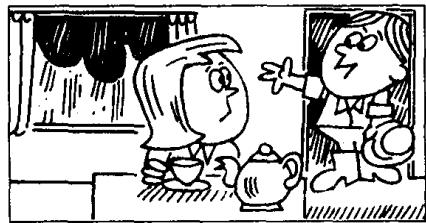

## Lesson 125 Tea for two 两个人一起喝茶

Listen to the tape then answer this question.

Does Susan have tea by herself?

听录音，然后回答问题。苏珊是一个人喝茶吗？

SUSAN: Can't you come in and have tea now, Peter?

PETER: Not yet. I must water the garden first.

SUSAN : Do you have to water it now?

PETER: I'm afraid I must. Look at it! It's terribly dry.

SUSAN : What a nuisance!

PETER: Last summer it was very dry, too. Don't you remember? I had to water it every day.

SUSAN : Well, I'll have tea by myself.

SUSAN : That was quick!
Have you finished already?

PETER: Yes. Look out of the window.

SUSAN: It's raining!  
That means  
you don't need to water the garden.

PETER : That was a pleasant surprise.
It means I can have tea, instead.

## New words and expressions 生词和短语

water /'wɔːtə/ v. 浇水

nuisance /'nju:səns/ n. 讨厌的东西或人

terribly /'teribli/ adv. 非常

dry /draɪ/ adj. 干燥的，干的

mean /miːn/ (meant /ment/, meant) v. 意味着，意思是

surprise /sə'praɪz/ n. 惊奇，意外的事

## Notes on the text 课文注释

I have to (过去式 had to)，不得不，必须。

have to 强调客观需要多一些。must 则着重说明主观看法。

2 What a nuisance! 真讨厌!

3 by myself, 我自己，独自。同样，我们可以说 by yourself, by himself, by herself, by itself, by ourselves, by yourselves, by themselves, by oneself。

## 参考译文

苏珊：彼得，你现在能进来喝茶吗？

彼得：还不能。我得先给花园浇水。

苏珊：你一定得现在浇吗？

彼得：恐怕我得现在浇。你看看，干得厉害。

苏珊：真讨厌！

彼得：去年夏天也是干得很。你不记得了吗？我不得不每天浇水。

苏珊：好吧，我一个人喝茶了。

苏珊：好快啊！你已经浇完了？

彼得：是的。你看看窗外。

苏珊：下雨了！这就是说，你不必给花园浇水了。

彼得：这是意想不到的好事。这意味着我反倒可以喝茶了。
