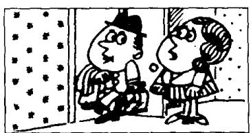
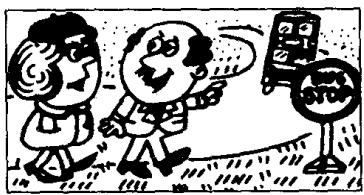

## Lesson 126 Have to and do not need to 不得不和不必要

Listen to the tape and answer the questions.
听录音并回答问题。

1  
  
Do you have to go now?
Yes, I have to leave
immediately.

2  
  
Do you have to get up early tomorrow morning? Yes, I'll have to get up at six o'clock.

3  

4  
  
Did you have to take a taxi?  
I'm afraid I had to.  
I couldn't get a bus.  
Hasn't your friend arrived yet? How long have you had to wait? I've had to wait for two hours!

5  
  
6  
Do you have to water the garden? No, I don't need to water it now. It's going to rain.

  
Do we have to walk to the station? No, we don't need to. We can catch a bus.

## New words and expressions 生词和短语

immediately /ɪ'mi:diətli/ adv. 立即地

## Written exercises 书面练习

A Write questions and answers.
抄写以下句子，然后提问并写出相应的否定句。

Examples:

You have to leave early.  
Do you have to leave early?  
You don't have to leave early.

She must leave early.
Must she leave early?
She needn't leave early.

1 She has to decide immediately.

2 She must decide immediately.

3 We have to take a taxi.

4 We must take a taxi.

B Answer these questions.
用 have to 或 has to 回答问题。

Example:

I must go now. What about you?
I have to go, too.

1 I must telephone him. What about you?

2 I must wait for him. What about Mary?

3 I must meet her. What about Jim?

4 I must travel by ship. What about Tom and Mary?

C Write questions.
模仿例句改写提问。

Example:

I must go now.

Do you really have to go now?

1 I must telephone him.

2 Mary must wait for him.

3 Jim must meet her.

4 Tom and Mary must travel by ship.
