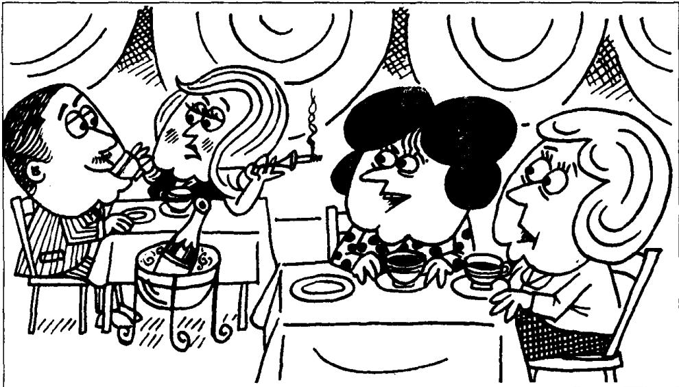

# Lesson 127 A famous actress 著名的女演员

Listen to the tape then answer this question.

Who is only twenty-nine, and why is it so unclear?

听录音，然后回答问题。谁只有29岁？为什么这件事如此含糊不清？

KATE : Can you recognize that woman, Liz?

LIZ: I think I can, Kate. It must be Karen Marsh, the actress.

KATE: I thought so. Who's that beside her?

LIZ: That must be Conrad Reeves.

KATE: Conrad Reeves, the actor?
It can't be.
Let me have another look.
I think you're right!
Isn't he her third husband?

LIZ : No. He must be her fourth or fifth.

KATE: Doesn't Karen Marsh look old!

LIZ: She does, doesn't she!
I read she's twenty-nine,
but she must be at least forty.

KATE: I'm sure she is.

LIZ : She was a famous actress when I was still at school.

KATE: That was a long time ago, wasn't it?

LIZ: Not that long ago!
I'm not more than twenty-nine myself.

## New words and expressions 生词和短语

famous /'feɪməs/ adj. 著名的

actor /'æktə/ n. 男演员

actress /'æktrɪs/ n. 女演员

read /riːd/ (read /red/, read) v. 通过阅读得知

at least /ət-list/ 至少

## Notes on the text 课文注释

1 在 It must be Karen Marsh ... 这一句中，must be 是英文中用来表示根据事实所作的推论，往往译为“一定”。must be 的否定式是 can't be, 如 Kate 的话 “It can't be.” 是对 Liz 的推论 (“That must be Conrad Reeves.”) 的否定。同时，请注意这里的 can't be（表示不可能）和第 45 课中 I can't type this letter.（表示能力）的区别。

2 Who's that beside her?
本句中 that 指人。

3 her fourth or fifth 后面省略了 husband。

4 Not that long ago!

句中的 that 是副词，指像 Kate 所说的 “那么” 遥远，可译作 “那样”，“那么”。课文中用斜体印刷表示一种强调，显然 Liz 对 Kate 的判断和对她本人年龄的估算很不满意。

## 参考译文

凯特：莉兹，你能认出那个女人吗？

莉兹：我想我认得出来，凯特。那一定是女演员卡伦·马什。

凯特：我也这样想。她旁边的那个人是谁？

莉兹：一定是康拉德·里弗斯。

凯特：康拉德·里弗斯，那个男演员吗？不可能是。让我再看一看。我想你是对的。他不是她的第3个丈夫吗？

莉兹：不，他一定是她的第4个或第5个丈夫。

凯特：卡伦看上去不显老嘛！

莉兹：是的，谁说不是呢！我从报上看到她是29岁，但她一定至少有40岁了。

凯特：我肯定她有40岁了。

莉兹：当我还是学生时，她就是个著名的演员了。

凯特：那是好久以前的事了，是吗？

莉兹：不，没有那么久。我自己现在还没29岁呢。
