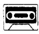
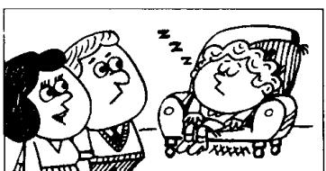
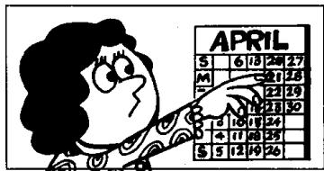
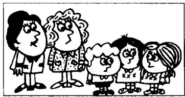
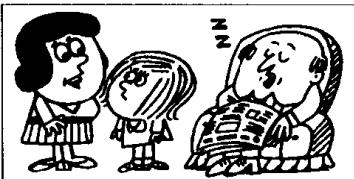

# Lesson 128 He can't be ... 他不可能…… He must be ... 他肯定是……

Listen to the tape and answer the questions.
听录音并回答问题。

1  
  
He can't be ill.  
He must be tired.

2  
  
It can't be my new hat. It must be my old one.

3  
  
She can't be Danish.  
She must be Swedish.

4  
  
He can't be a dentist.  
He must be a doctor.

5  
  
She can't be forty.  
She must be fifty.

6  
  
It can't be the 20th. It must be the 21st.

7  
  
He can't be the youngest.  
He must be the oldest.

8  
  
He can't be reading.  
He must be sleeping.

## Written exercises 书面练习

A Rewrite these sentences, using either has to or I think he is probably...

模仿例句，使用 has to 或 I think he is probably ... 改写以下句子。

## Examples:

He must be home before six o'clock.

He has to be home before six o'clock.

He must be tired.
I think he is probably tired.

1 He must be here at six o'clock.

2 He must be busy.

3 He must be at the office early tomorrow.

4 He must be sleeping.

5 He must be French.

6 He must be in France next week.

7 He must be an engineer.

## B Write new sentences.

模仿例句改写下列句子。

## Example:

I think she's Danish. (Swedish)

I don't think so. She can't be Danish.

She must be Swedish.

1 I think she's Italian. (Greek)

2 I think he's English. (American)

3 I think they're Canadian. (Australian)

4 I think he's a mechanic. (engineer)

5 I think he's a bus conductor. (bus driver)

6 I think he's a sales rep. (the boss)

7 I think he's twenty-four. (thirty)

8 I think they're five. (seven)

9 I think he's seventy-six. (over eighty)

10 I think she's fifty-five. (under fifty)

11 I think it's the 21st today. (20th)

12 I think it's Tuesday today. (Wednesday)

13 I think it's the 2nd today. (3rd)

14 I think it's cheap. (expensive)

15 I think it's easy. (difficult)

16 I think she's old. (young)

17 I think they're early. (late)

18 I think he's reading. (sleeping)

19 I think they're listening to the radio. (watching television)

20 I think she's retiring. (looking for a new job)
