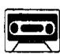
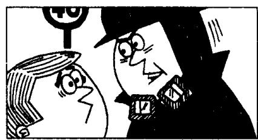
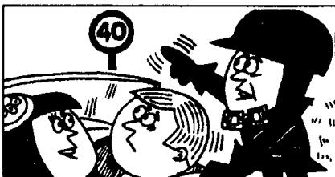
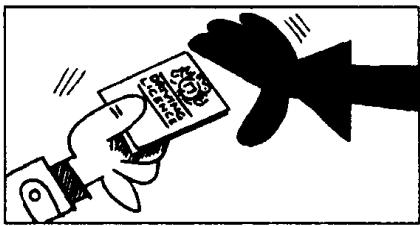

## Lesson 129 Seventy miles an hour 时速 70 英里

Listen to the tape then answer this question. What does Ann advise her husband to do next time?

听录音，然后回答问题。安建议她的丈夫下次做什么？

ANN : Look, Gary!
That policeman's waving to you.
He wants you to stop.

POLICEMAN: Where do you think you are? On a race track? You must have been driving at seventy miles an hour.

GARY: I can't have been.

POLICEMAN: I was doing eighty when I overtook you.

POLICEMAN: Didn't you see the speed limit?

GARY : I'm afraid I didn't, officer. I must have been dreaming.

ANN: He wasn't dreaming, officer. I was telling him to drive slowly.

GARY: That's why I didn't see the sign.

POLICEMAN : Let me see your driving licence.

POLICEMAN: I won't charge you this time. But you'd better not do it again!

GARY : Thank you. I'll certainly be more careful.

ANN : I told you to drive slowly, Gary.

GARY : You always tell me to drive slowly, darling.

ANN: Well, next time you'd better take my advice!

## New words and expressions 生词和短语

speed limit /'spi:d ,limit/ 限速

wave /weiv/ v. 招手

dream /driːm/ v. 做梦，思想不集中

track /træk/ n. 跑道

sign /saɪn/ n. 标记，牌子

mile /maɪl/ n. 英里

driving licence 驾驶执照

overtake /ˌəʊvəˈteɪk/ (overtook, overtaken) v.

从后面超越，超车

charge /tʃɑːdʒ/ v. 罚款

darling /'dɑːlɪŋ/ n. 亲爱的（用作表示称呼）

## Notes on the text 课文注释

1 Where do you think you are?

do you think 是用在特殊疑问句中的插入语，用来征询见解或表达看法。

2 must have been driving,

这种结构用来表示对过去正进行的事情的推测。可译为“一定”或“准是”。

3 at seventy miles an hour, 每小时 70 英里的速度。

4 I was doing eighty when I overtook you.

其中的动词 do 表示“以……速度行进”。

5 But you'd better not do it again!

you'd better = you had better, 后面加动词原形。

had better 用于建议在将来某一具体场合采取动作, 而不用于一般情况, 比 should 语气更为强烈, 常有威胁、告诫或催促的意味。

6 you'd better take my advice! 你最好还是听从我的劝告。take one's advice 是“听从劝告”的意思。

## 参考译文

安：瞧，加里！那个警察正朝你挥手呢。他要你停下来。

警察：你认为你现在是在哪儿？在赛车道上吗？你刚才一定是以每小时70英里的速度开车。

加里：我不会开得那样快的。

警察：我是以每小时80英里的速度赶上你的。

警察：难道你没看见限速牌吗？

加里：恐怕我没有看见，警官。我一定是思想开小差了。

安：警官，他思想没有开小差。我刚才正告诉他开慢点。

加里：所以我才没看见那牌子。

警察：让我看一看你的驾驶执照。

警察：这次我就不罚你款了。但你最好不要再开得这样快。

加里：谢谢您。我以后一定会多加注意。

安：加里，我刚才叫你开慢点吧。

加里：你总是叫我开慢点，亲爱的。

安：好啦，下次你最好还是听从我的劝告吧！
