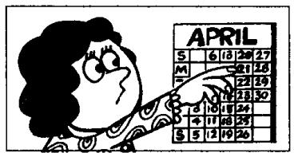
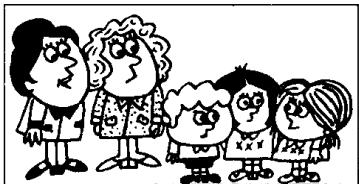

## Lesson 130 He can't have been ... 他那时不可能…… He must have been ... 他那时肯定是……

Listen to the tape and answer the questions.
听录音并回答问题。

|  
  
He can't have been ill.  
He must have been tired.

2  
  
It can't have been my new hat. It must have been my old one.

3  
  
She can't have been Danish.  
She must have been Swedish.

4  
  
He can't have been a dentist.  
He must have been a doctor.

5  
  
She can't have been forty.  
She must have been fifty.

6  
  
It can't have been the 20th. It must have been the 21st.

7  
  
He can't have been the youngest. He must have been the oldest.

8  
  
He can't have been reading.  
He must have been sleeping.

## Written exercises 书面练习

A Complete these sentences using had to or must have been.

完成以下句子，用 had to 或 must have been 填空。

Example:

He is very tired because he had to get up early this morning.

He didn't get up early this morning. He must have been tired.

1 He didn't come to work yesterday. He \_\_\_\_ ill.

2 He didn't come to the office this morning. He \_\_\_\_ stay at home.

3 I don't think she was Austrian. She \_\_\_\_ German.

4 I lost my pen so I \_\_\_\_ buy a new one.

5 He forgot his case so he \_\_\_\_ return home.

6 She didn't hear the phone. She \_\_\_\_ sleeping.

B Write new sentences.

模仿例句改写以下句子。

## Example:

I think she was Danish. (Swedish)

I don't think she was. She can't have been Danish.

She must have been Swedish.

1 I think they were Canadian. (Australian)

2 I think she was Finnish. (Russian)

3 I think they were Japanese. (Chinese)

4 I think they were butchers. (bakers)

5 I think she was a dentist. (doctor)

6 I think he was a sales rep. (the boss)

7 I think she was seventeen. (twenty-one)

8 I think they were five. (seven)

12 I think it was Tuesday yesterday. (Wednesday)

13 I think it was the 19th yesterday. (20th)

9 I think he was seventy-six. (over eighty)

10 I think she was fifty-five. (under fifty)

11 I think it was the 17th yesterday. (16th)

14 I think it was cheap. (expensive)

15 I think it was easy. (difficult)

16 I think she was old. (young)

17 I think he was ill. (tired)

18 I think they were listening to the radio. (watching television)

19 I think she was retiring. (looking for a new job)

20 I think they were sitting. (standing)
